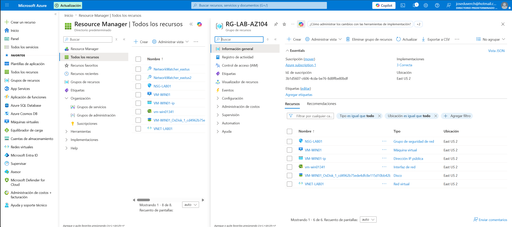
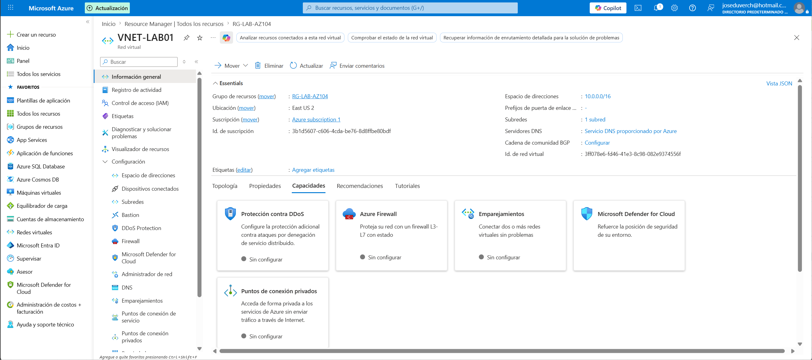
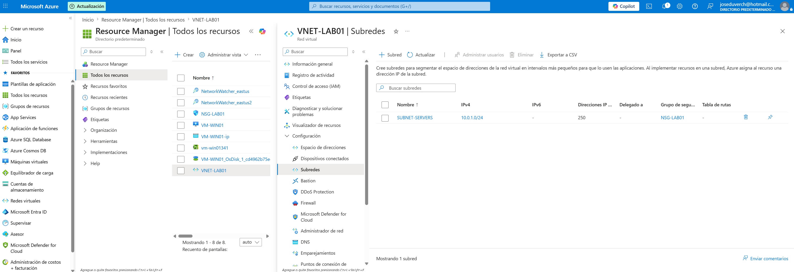
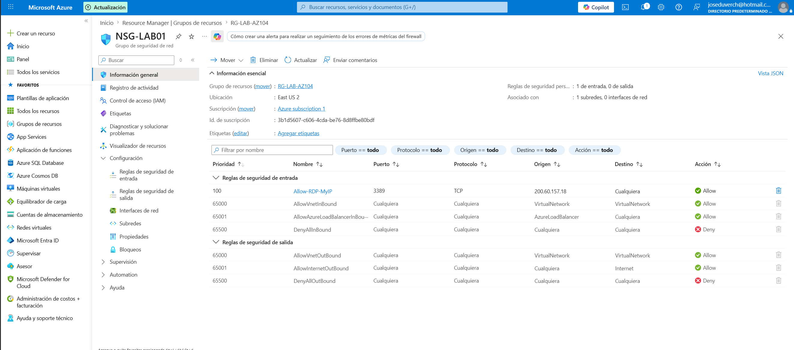
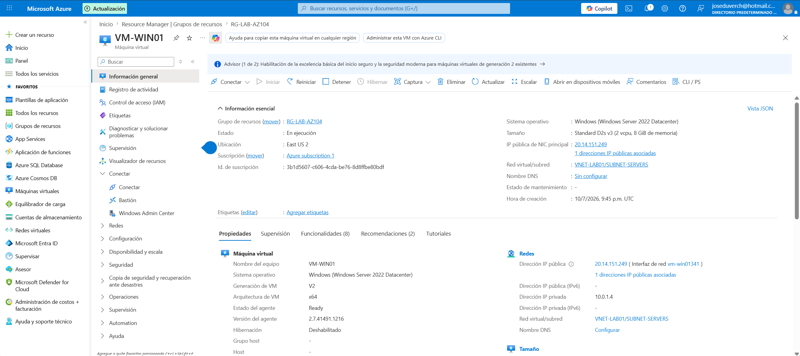
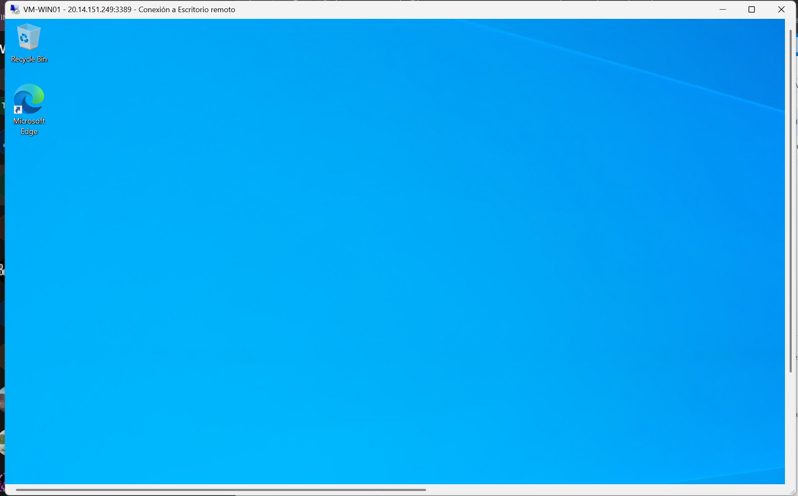

# Proyecto 01 - Implementación de infraestructura básica en Azure

## Objetivo

Implementar una infraestructura básica en Microsoft Azure utilizando una red virtual, un grupo de seguridad de red y una máquina virtual Windows.

---

## Recursos implementados

- Resource Group: RG-LAB-AZ104
- Virtual Network: VNET-LAB01
- Subnet: SUBNET-SERVERS
- Network Security Group: NSG-LAB01
- Windows Server 2022 Virtual Machine
- Public IP
- Network Interface (NIC)
- Managed Disk

---

## Arquitectura

```text
RG-LAB-AZ104
│
├── VNET-LAB01
│     └── SUBNET-SERVERS
│
├── NSG-LAB01
│
├── VM-WIN01
│
├── Public IP
│
├── Network Interface
│
└── Managed Disk
```

---

## Evidencias

### Resource Group



### Virtual Network




### Network Security Group



### Máquina Virtual



### Conexión por RDP



---

## Problemas encontrados

Durante el laboratorio se presentaron los siguientes inconvenientes:

- Registro del proveedor `Microsoft.Compute`.
- Restricciones de tamaño de máquina virtual (`NotAvailableForSubscription`).
- Configuración de Availability Zones.
- Configuración de reglas para acceso RDP.

---

## Habilidades demostradas

- Creación de Resource Groups.
- Configuración de Virtual Networks.
- Administración de Subnets.
- Configuración de Network Security Groups.
- Implementación de Azure Virtual Machines.
- Acceso remoto mediante RDP.
- Diagnóstico y resolución de problemas de implementación.

---

## Resultado

Se desplegó correctamente una infraestructura básica en Azure y se estableció conexión remota a la máquina virtual mediante RDP.