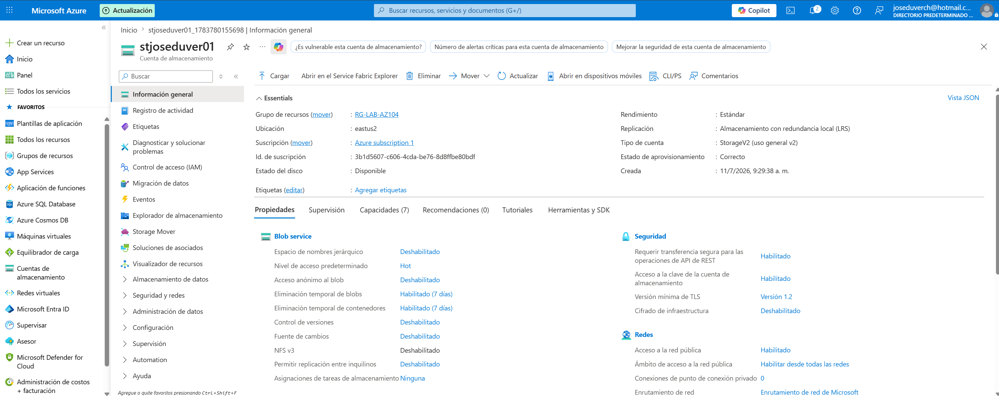
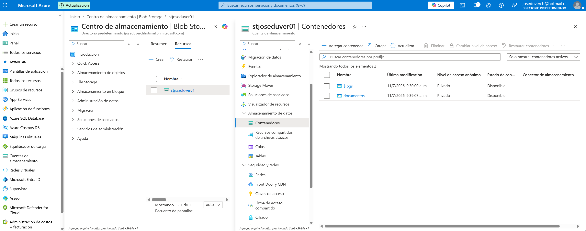
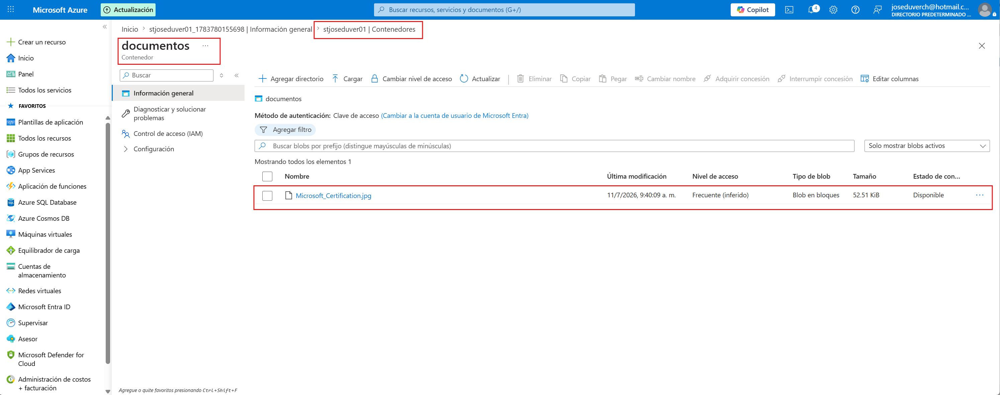
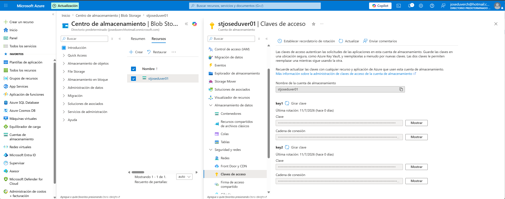
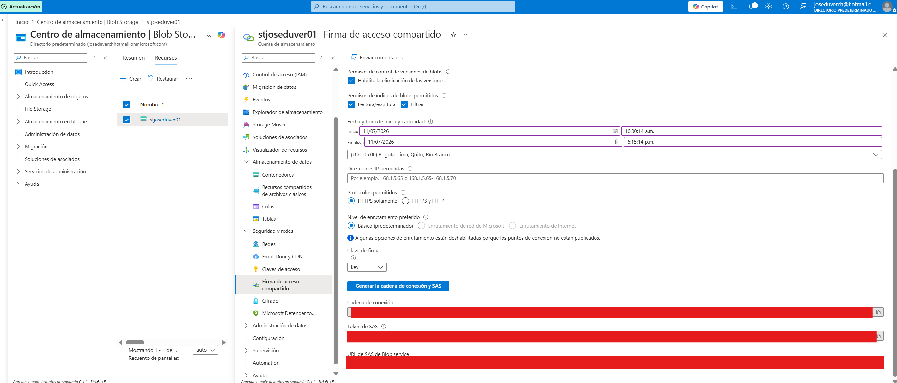

# Proyecto 02 - Azure Storage Account

## Objetivo

Implementar y administrar un Azure Storage Account utilizando Blob Storage y mecanismos seguros de acceso.

---

## Recursos implementados

- Storage Account (StorageV2)

- Blob Container

- Archivo cargado

- Access Keys

- Shared Access Signature (SAS)

---

## Configuración

- Región: East US 2

- Rendimiento: Standard

- Redundancia: LRS

- Tipo de cuenta: StorageV2

---

## Evidencias

### Storage Account

### Blob Container

### Archivo cargado

### Access Keys

### SAS Token

---

## Conceptos aprendidos

- Azure Storage Account

- Blob Storage

- Blob Containers

- Access Keys

- SAS Tokens

- Seguridad en Azure Storage

---

## Resultado

Se implementó correctamente un Azure Storage Account, se almacenaron archivos en Blob Storage y se configuró un mecanismo de acceso temporal mediante SAS Token.