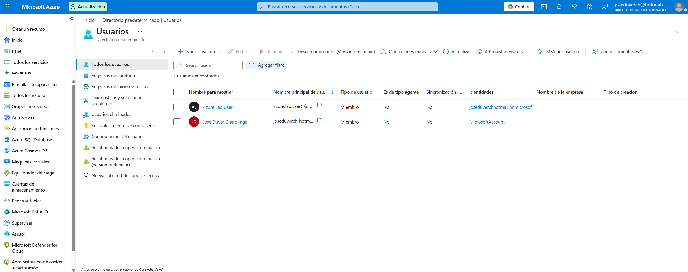
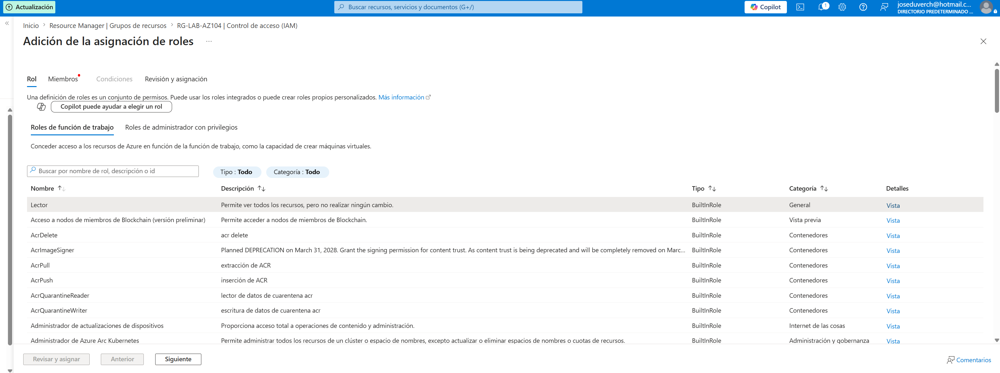
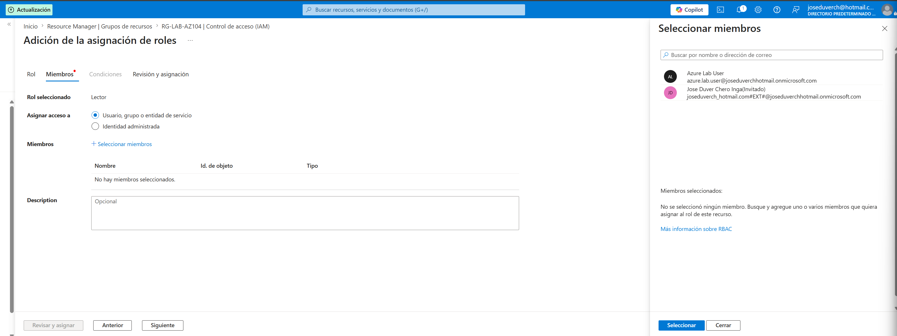
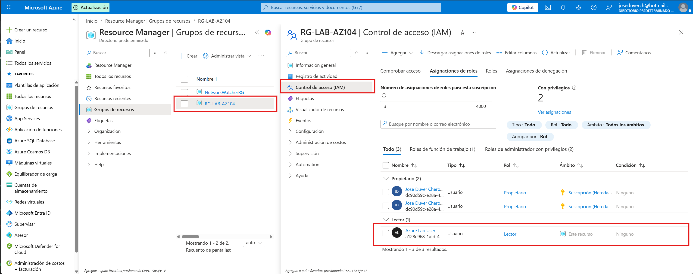
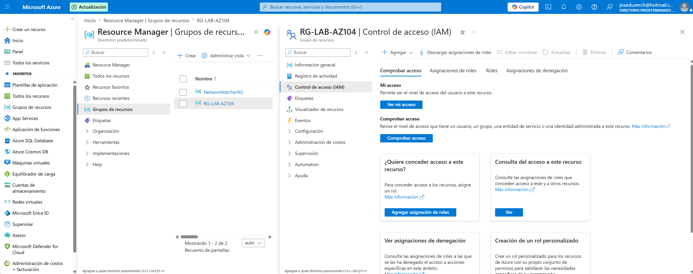

# Proyecto 03 - Azure RBAC

## Objetivo

Implementar el control de acceso basado en roles (RBAC) utilizando Microsoft Entra ID y Azure IAM.

---

## Recursos utilizados

- Microsoft Entra ID

- Azure Resource Group

- Azure RBAC

- Usuario de prueba

---

## Rol asignado

**Reader**

Este rol permite visualizar los recursos sin realizar modificaciones.

---

## Evidencias

### Usuario creado

### Asignación del rol Reader

### Control de acceso (IAM)

---

## Conceptos aprendidos

- Microsoft Entra ID

- Azure RBAC

- Control de acceso (IAM)

- Roles integrados

- Principio de mínimo privilegio

---

## Roles principales

| Rol | Descripción |

|------|-------------|

| Reader | Solo lectura |

| Contributor | Puede crear y modificar recursos |

| Owner | Control total, incluyendo la administración de permisos |

---

## Resultado
Se creó un usuario en Microsoft Entra ID y se asignó el rol Reader sobre un grupo de recursos mediante Azure RBAC.
