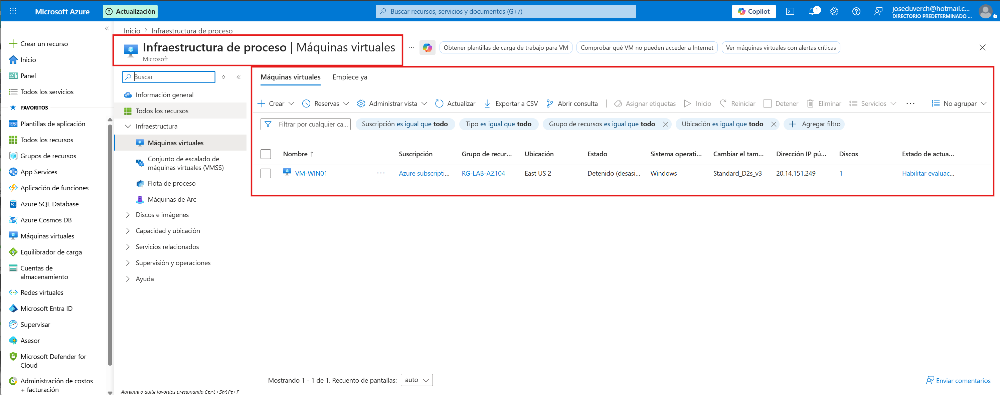
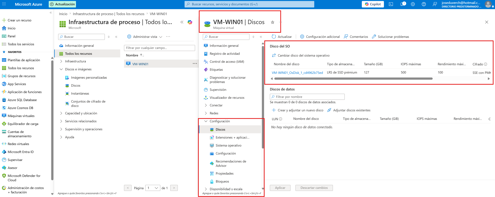
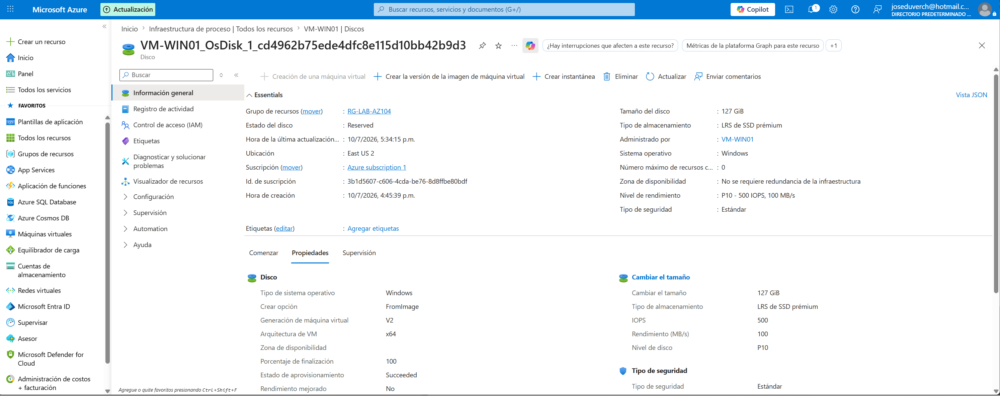
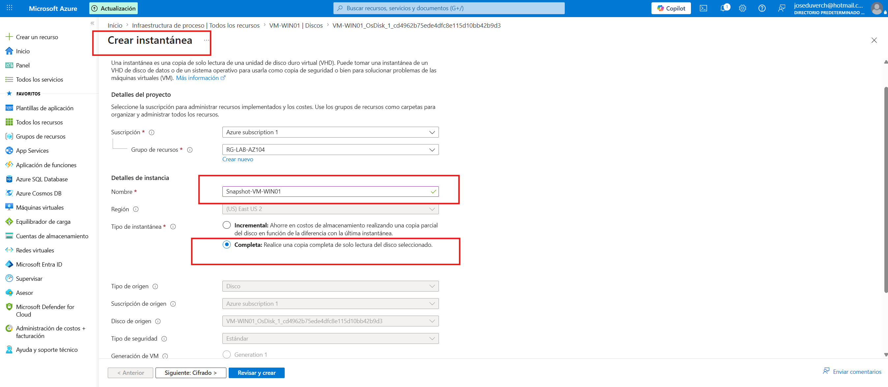
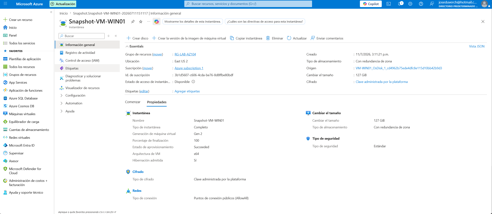

# Proyecto 05 - Azure Managed Disks y Snapshots

## Objetivo

Aprender a administrar discos administrados (Managed Disks) y crear snapshots para proteger una máquina virtual.

---

## Recursos utilizados

- Azure Virtual Machine

- Managed Disk

- Snapshot

- Azure Storage

---

## Configuración

- Máquina Virtual: VM-WIN01

- Región: East US 2

- Tipo de Snapshot: Full

- Redundancia: LRS

- Tipo de almacenamiento: Standard HDD (LRS)

---

## Evidencias

### Máquina Virtual

### Discos de la VM

### Disco del sistema operativo

### Configuración del Snapshot

### Snapshot creado

---

## Conceptos aprendidos

- Managed Disks

- Snapshots

- Protección de discos

- Recuperación de datos

- Azure Storage

---

## Diferencia entre Managed Disk y Snapshot

| Managed Disk | Snapshot |

|--------------|----------|

| Disco utilizado por la VM | Copia puntual del disco |

| Contiene el sistema operativo o datos | Permite restaurar o clonar un disco |

| Está en uso por la VM | No está conectado a una VM |

---

## Resultado

Se creó un snapshot del disco del sistema operativo de la máquina virtual VM-WIN01 para disponer de un punto de recuperación ante posibles cambios o incidentes.

