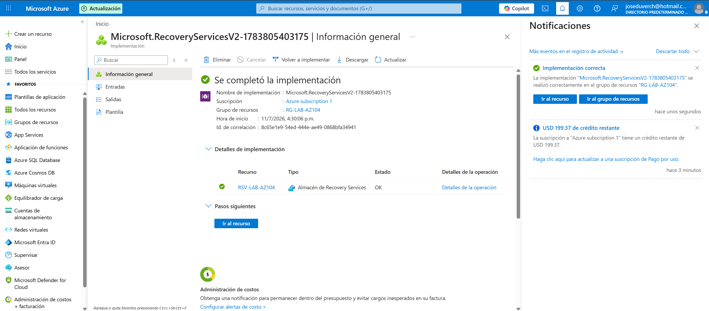
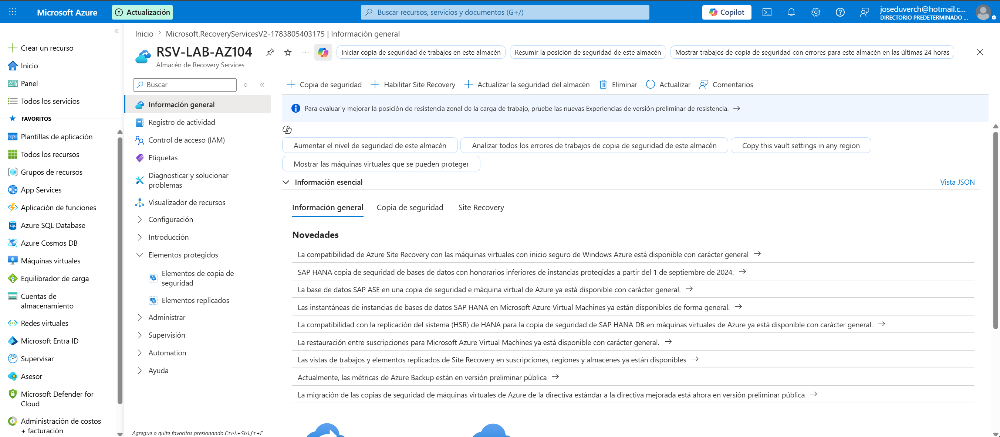
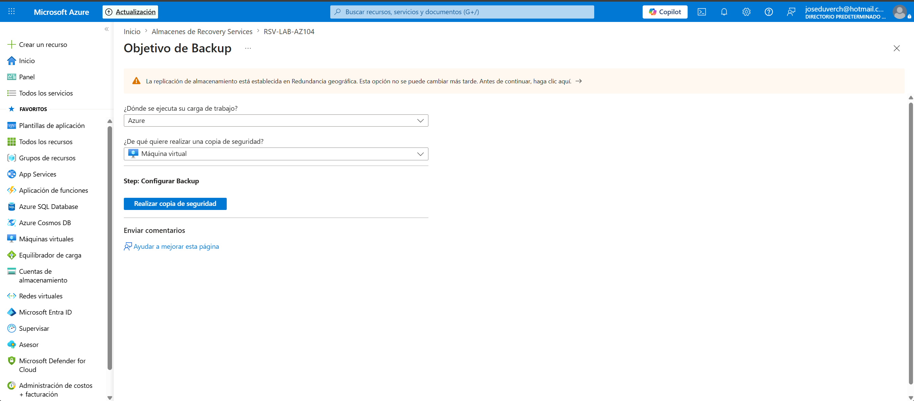
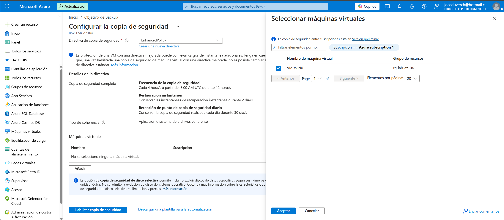
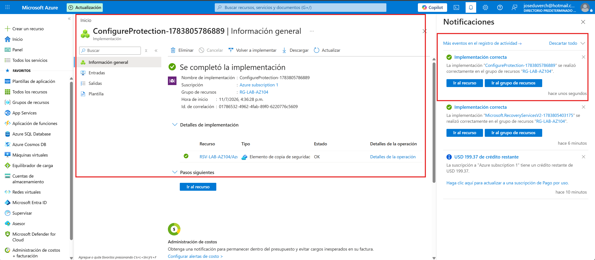
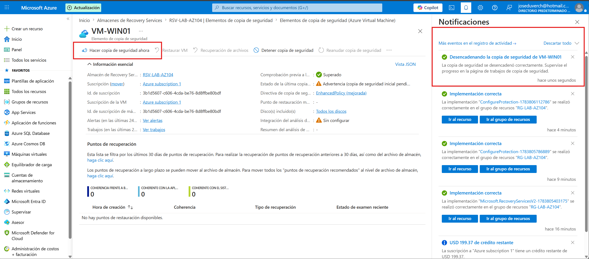
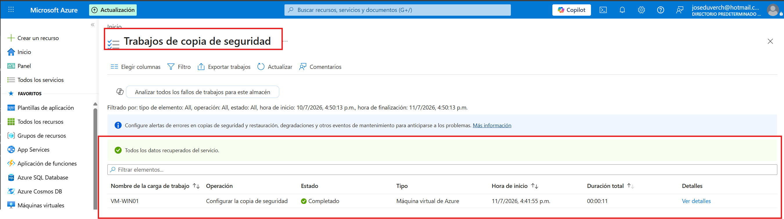

# Proyecto 06 - Azure Backup

## Objetivo

Implementar Azure Backup mediante un Recovery Services Vault para proteger una máquina virtual.

---

## Recursos utilizados

- Recovery Services Vault
- Azure Backup
- Máquina Virtual (VM-WIN01)

---

## Configuración

- Recovery Services Vault: RSV-LAB-AZ104
- Máquina virtual protegida: VM-WIN01
- Política: Predeterminada

---

## Evidencias

### Recovery Services Vault

### Configuración del Backup

### Política de Backup

### Backup habilitado

### Backup manual (opcional)

---

## Conceptos aprendidos

- Azure Backup
- Recovery Services Vault
- Backup Policy
- Protección de máquinas virtuales
- Recuperación ante desastres

---

## Diferencia entre Snapshot y Backup

| Snapshot | Backup |
|----------|---------|
| Copia puntual del disco | Protección completa de la VM |
| Ideal antes de cambios importantes | Ideal para recuperación ante desastres |
| No sustituye un backup | Diseñado para estrategias de respaldo |

---

## Resultado

Se configuró Azure Backup para proteger la máquina virtual VM-WIN01 mediante un Recovery Services Vault y una política de copia de seguridad.