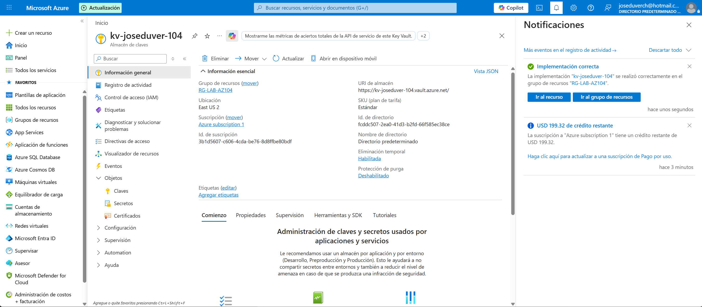
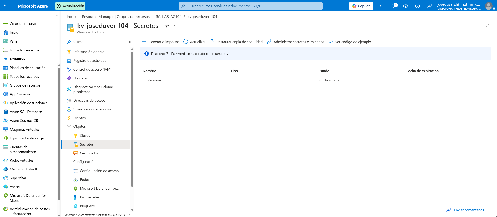
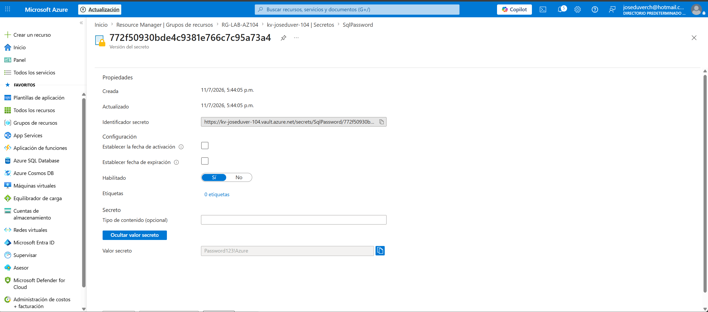
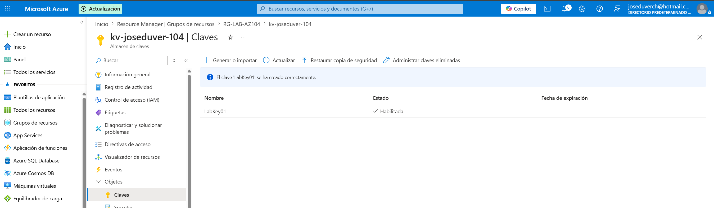
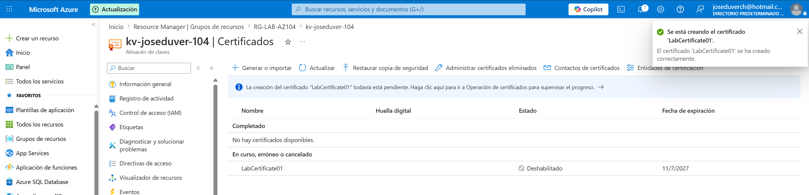

# Proyecto 07 - Azure Key Vault

## Objetivo

Implementar Azure Key Vault para almacenar y administrar de forma segura secretos, claves criptográficas y certificados.

---

## Recursos implementados

- Azure Key Vault

- Secret

- Cryptographic Key

- Self-Signed Certificate

---

## Configuración

- Key Vault: kv-joseduver-104

- Región: East US 2

- Grupo de recursos: RG-LAB-AZ104

---

## Evidencias

### Azure Key Vault

### Creación del Secret

### Valor del Secret

### Creación de la Key

### Creación del Certificado

---

## Conceptos aprendidos

- Azure Key Vault

- Secrets

- Cryptographic Keys

- Certificates

- Azure RBAC

- Administración segura de credenciales

---

## Lecciones aprendidas

- Azure Key Vault permite almacenar información confidencial de forma segura.

- Los permisos pueden administrarse mediante Azure RBAC.

- Un Secret almacena credenciales.

- Una Key se utiliza para operaciones criptográficas.

- Un Certificate permite proteger comunicaciones y autenticar servicios.

---

## Resultado

Se implementó un Azure Key Vault, se creó un secreto, una clave criptográfica y un certificado, comprobando el funcionamiento del control de acceso basado en Azure RBAC.

