# Azure Load Balancer - Configuración y Prueba de Balanceo de Carga


## Descripción


En este laboratorio implementé un **Azure Load Balancer Standard** para distribuir el tráfico HTTP entre dos máquinas virtuales Windows Server con IIS instalado.


El objetivo fue comprender la configuración de un balanceador de carga, Backend Pool, Health Probe, reglas de equilibrio y validación del funcionamiento mediante pruebas reales.


---


# Arquitectura


```

Internet

   │

   ▼

Public IP

  │

  ▼

Azure Load Balancer

   │

   ▼

Backend Pool

┌───────────────┐

│               │

▼               ▼

VM-WIN01      VM-WIN02

IIS             IIS

```


---


# Recursos utilizados


| Recurso | Nombre |

|----------|---------|

| Resource Group | RG-LAB-AZ104 |

| Virtual Network | VNET-LAB01 |

| Load Balancer | LB-LAB01 |

| Public IP | PIP-LB01 |

| Backend Pool | BEPOOL-LAB01 |

| Health Probe | HP-HTTP |

| Regla de Balanceo | LBRule-HTTP |

| Virtual Machine | VM-WIN01 |

| Virtual Machine | VM-WIN02 |


---


# Paso 1 - Máquinas Virtuales


Se verificó que ambas máquinas virtuales estuvieran correctamente implementadas.


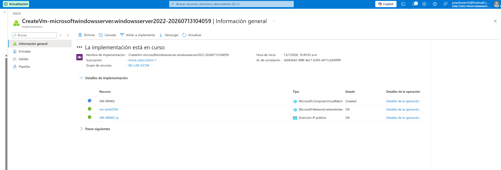


---


# Paso 2 - Creación del Load Balancer


Se inició la implementación del Azure Load Balancer Standard.


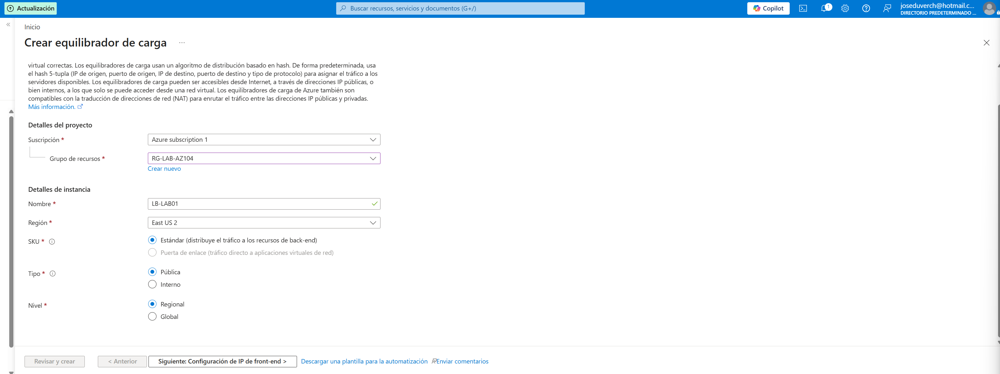


---


# Paso 3 - Configuración del Front-end


Se creó una Dirección IP Pública para recibir el tráfico entrante.


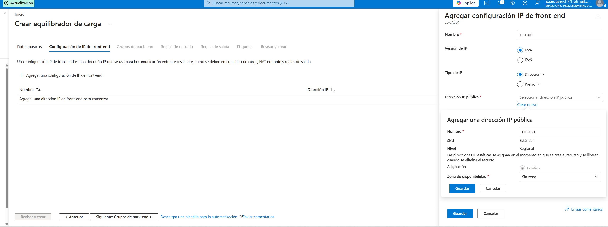


Posteriormente se verificó que la configuración quedara aplicada correctamente.


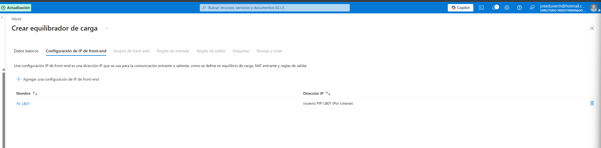


---


# Paso 4 - Creación del Backend Pool


Se creó el Backend Pool que almacenará las máquinas virtuales que atenderán las solicitudes.


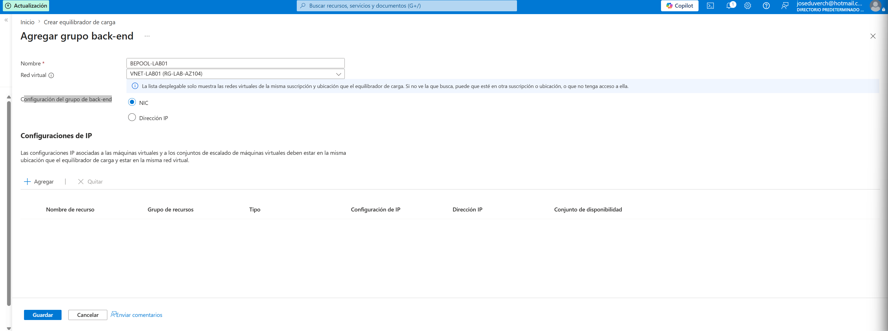


Posteriormente se agregaron ambas máquinas virtuales mediante sus interfaces de red (NIC).


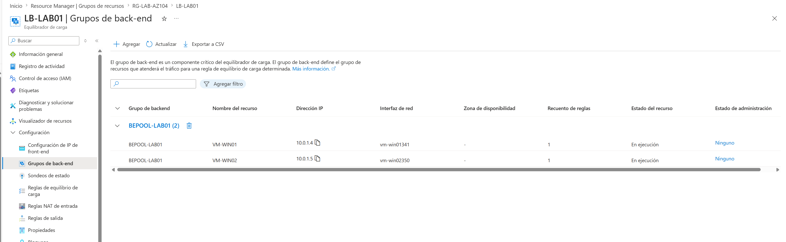


---


# Paso 5 - Configuración de la Regla de Balanceo


Se creó la regla HTTP para distribuir el tráfico entre ambas máquinas virtuales.


Configuración:


- Frontend Port: **80**

- Backend Port: **80**

- Protocolo: **TCP**


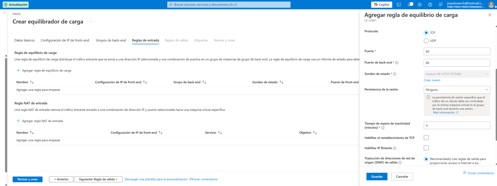


Configuración final.


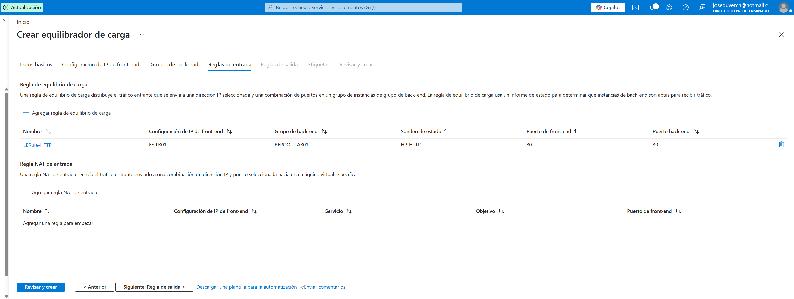


---


# Paso 6 - Implementación completada


Azure implementó correctamente todos los recursos.


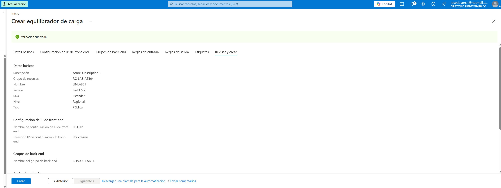
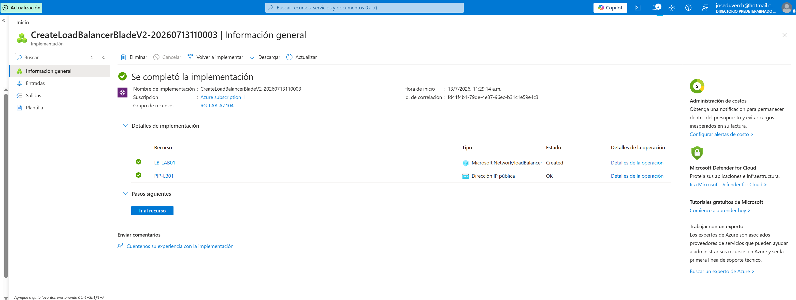


---


# Paso 7 - Instalación de IIS


Se instaló el rol **Web Server (IIS)** en ambas máquinas virtuales.


## VM-WIN01


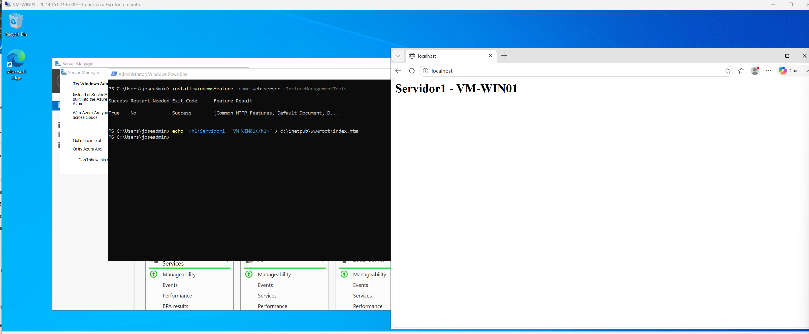


## VM-WIN02


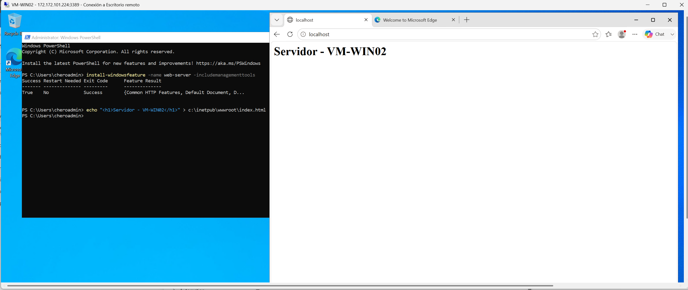


---


# Paso 8 - Verificación del Backend Pool


Se comprobó que ambas máquinas virtuales forman parte del Backend Pool.


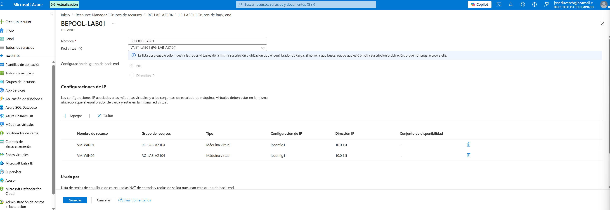


---


# Paso 9 - Configuración del Health Probe


Se configuró un Health Probe TCP sobre el puerto 80 para verificar la disponibilidad de los servidores.


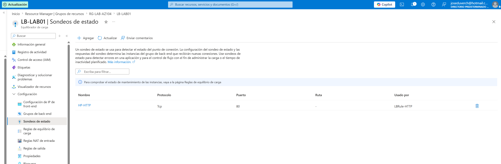


---


# Paso 10 - Verificación de la Regla de Balanceo


Se comprobó que la regla utiliza correctamente:


- Backend Pool

- Health Probe

- Puerto TCP 80


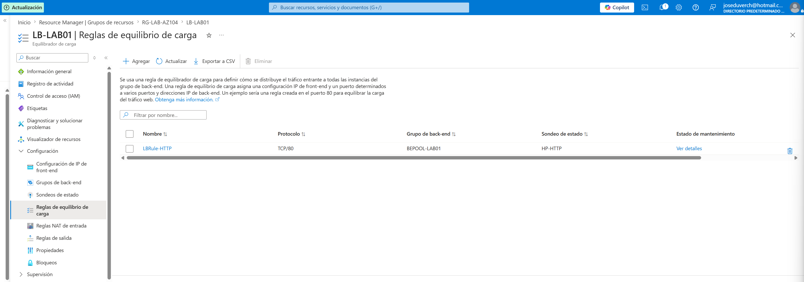


---


# Paso 11 - Configuración del Network Security Group


Se agregó una regla de entrada para permitir tráfico HTTP (Puerto 80).


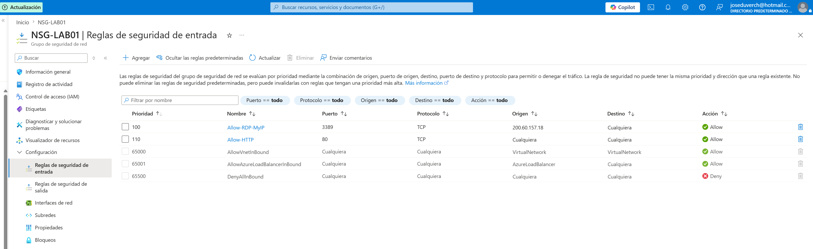


---


# Paso 12 - Validación del Balanceador


Al acceder mediante la Dirección IP Pública del Load Balancer, las solicitudes fueron distribuidas correctamente entre ambas máquinas virtuales.


## Respuesta desde VM-WIN01


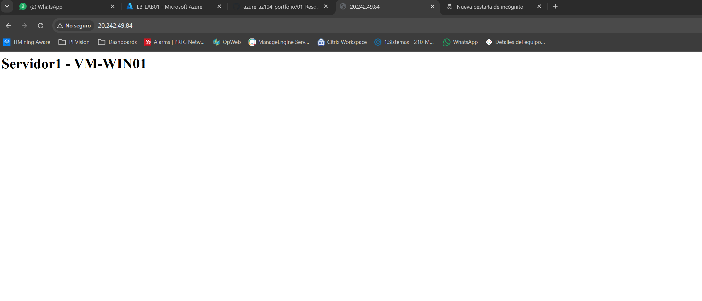


## Respuesta desde VM-WIN02


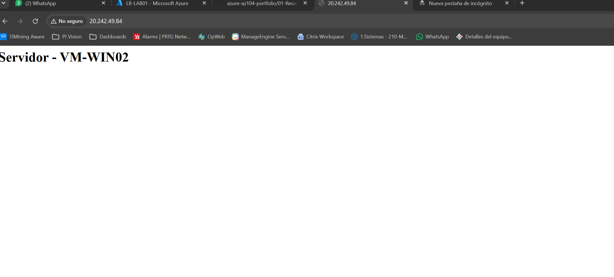


---


# Resultado


Se logró implementar exitosamente un Azure Load Balancer Standard con las siguientes características:


- ✔ Front-end IP Pública

- ✔ Backend Pool configurado

- ✔ Dos máquinas virtuales Windows Server

- ✔ IIS instalado

- ✔ Health Probe funcionando

- ✔ Regla de Balanceo HTTP

- ✔ Tráfico distribuido correctamente entre ambas máquinas virtuales


---


# Tecnologías utilizadas


- Microsoft Azure

- Azure Load Balancer Standard

- Azure Virtual Machines

- Azure Virtual Network

- Azure Network Security Group (NSG)

- Windows Server

- IIS (Internet Information Services)

- TCP/IP

- HTTP


---


# Habilidades demostradas


- Implementación de Azure Load Balancer

- Configuración de Front-end IP

- Configuración de Backend Pools

- Administración de Máquinas Virtuales

- Configuración de Health Probe

- Configuración de Reglas de Balanceo

- Administración de Network Security Groups

- Configuración de IIS

- Solución de problemas de conectividad

- Validación de alta disponibilidad


