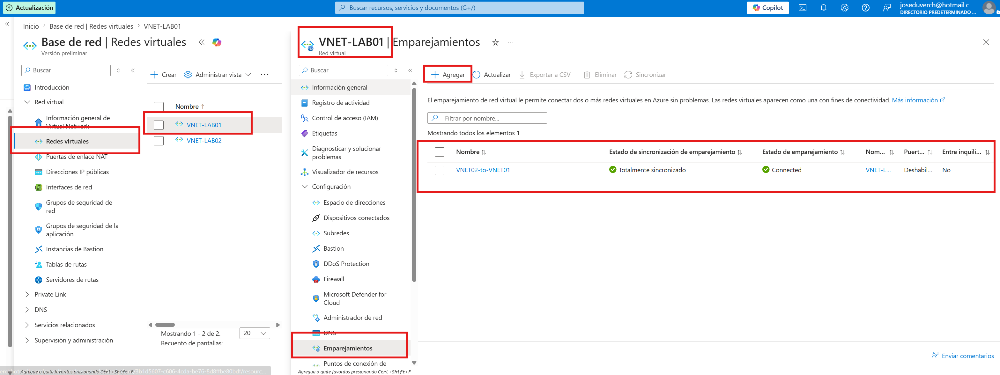

# 🌐 Azure Virtual Network Peering


## 📌 Objetivo


Implementar Azure Virtual Network Peering para permitir la comunicación privada entre dos redes virtuales dentro de la misma suscripción y región de Azure.


---


# 🏗️ Arquitectura


```

              Azure Subscription


             RG-LAB-AZ104

                      │

     ┌────────────────┴────────────────┐

      │                                 │

 VNET-LAB01                       VNET-LAB02

 10.0.0.0/16                      10.1.0.0/16

     │                                 │

 VM-WIN01                         (Sin VM)

 VM-WIN02

   │

   └──────────── Peering ────────────┘

```


---


# 🎯 Objetivos del laboratorio


- Crear una segunda Virtual Network.

- Configurar Virtual Network Peering.

- Permitir la comunicación entre ambas redes virtuales.

- Comprender el funcionamiento del emparejamiento de redes en Azure.

- Validar el estado del peering.


---


# 🛠️ Recursos utilizados


| Recurso | Nombre |
|----------|---------|
| Resource Group | RG-LAB-AZ104 |
| Virtual Network | VNET-LAB01 |
| Virtual Network | VNET-LAB02 |
| Virtual Network Peering | VNET01-to-VNET02 |
| Virtual Network Peering | VNET02-to-VNET01 |


---


# 📷 Evidencias


## 1. Creación de la segunda Virtual Network


---


## 2. Estado Connected del Peering





---


# 🔍 Verificación


Se comprobó que:


- Ambas Virtual Networks pertenecen a la misma región (\*\*East US 2\*\*).

- Los espacios de direcciones IP no se superponen.

- El Virtual Network Peering quedó en estado \*\*Connected\*\*.

- Se habilitó el acceso entre ambas redes virtuales.


---


# ⚠️ Limitación encontrada


El emparejamiento entre VNET-LAB01 y VNET-LAB02 fue implementado correctamente y ambos peerings alcanzaron el estado Connected, confirmando que la configuración fue exitosa.

La validación mediante una máquina virtual adicional no pudo realizarse debido a la cuota de vCPU disponible en la suscripción de laboratorio, que impedía crear una tercera máquina virtual.

La configuración quedó preparada para realizar dicha prueba una vez exista capacidad disponible.

---


# 📚 Conceptos aprendidos


- Azure Virtual Networks

- Address Spaces

- Subnets

- Virtual Network Peering

- Comunicación privada entre VNets

- Configuración de acceso entre redes

- Limitaciones de cuotas (vCPU Quotas)


---


# 💡 Conclusiones


Azure Virtual Network Peering permite conectar dos redes virtuales de manera privada utilizando la infraestructura de Microsoft, sin necesidad de utilizar Internet pública.


Durante este laboratorio se implementó correctamente el emparejamiento entre dos redes virtuales y se verificó su estado de funcionamiento. La validación mediante máquinas virtuales quedó pendiente debido a una limitación de cuota de la suscripción utilizada para el laboratorio, situación común en entornos de prueba y laboratorio.


---


