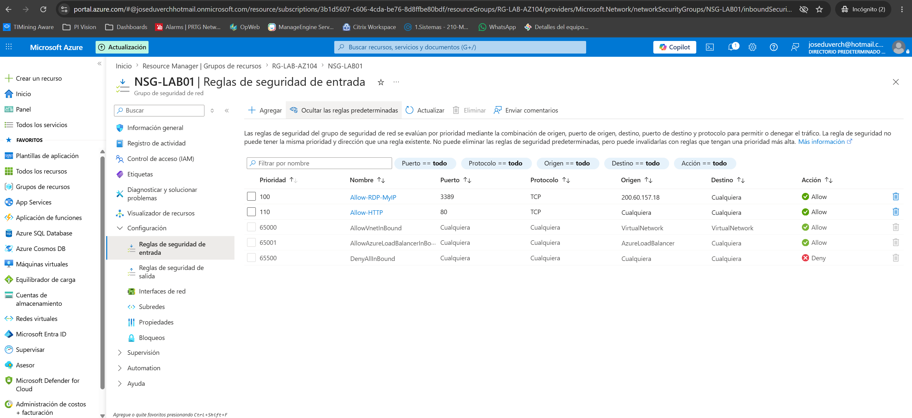
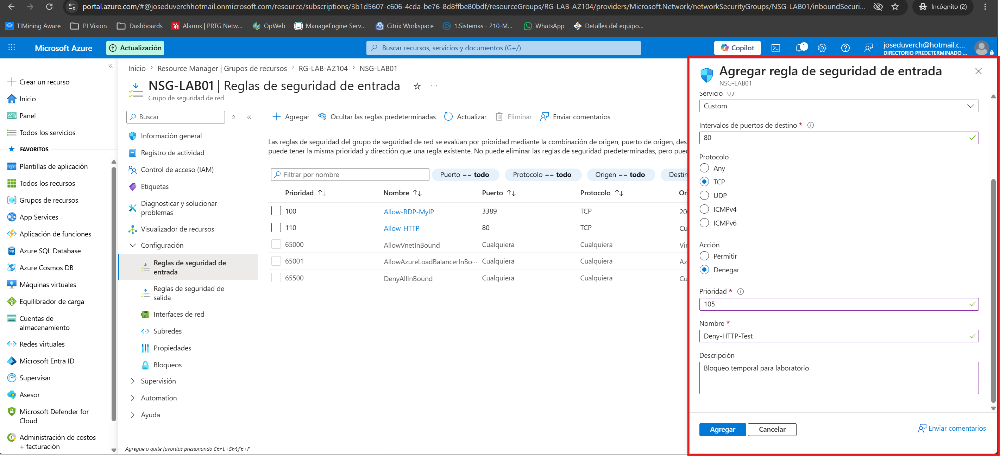
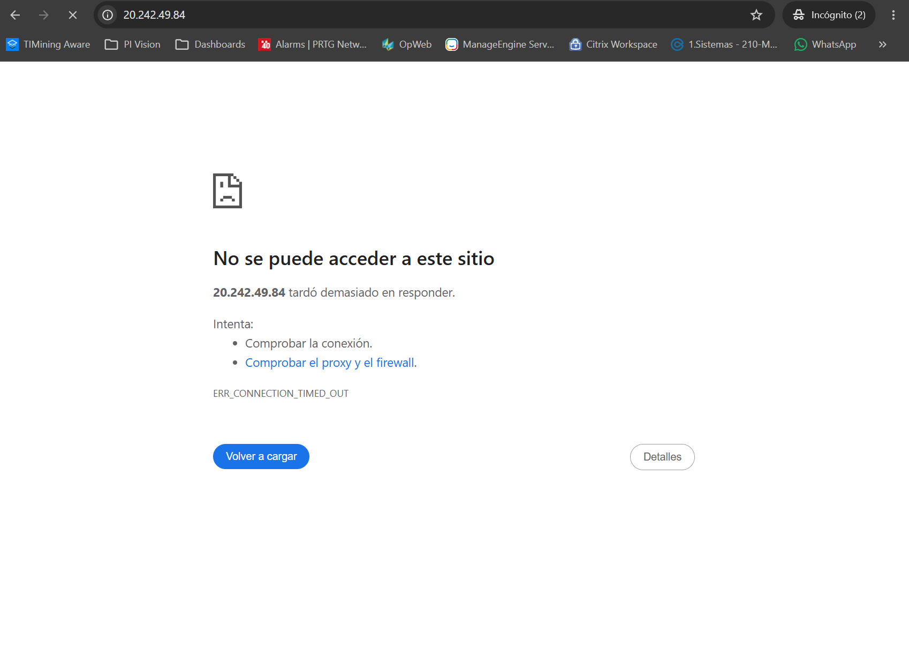
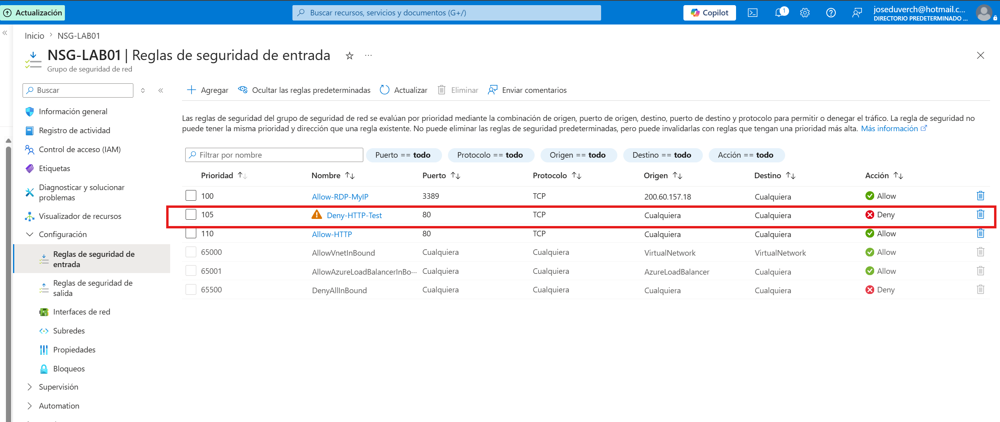
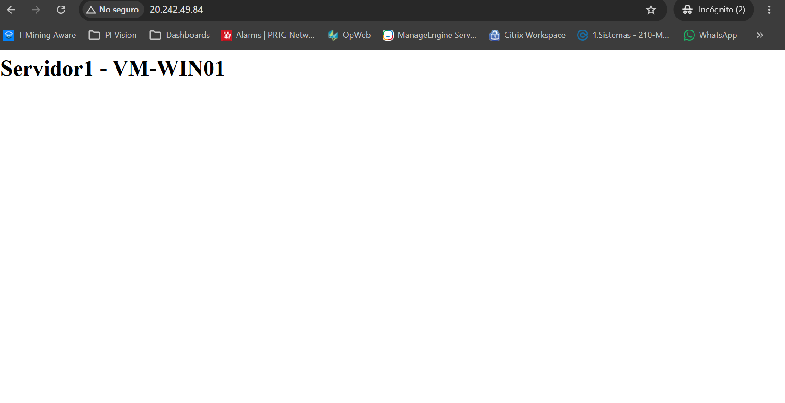
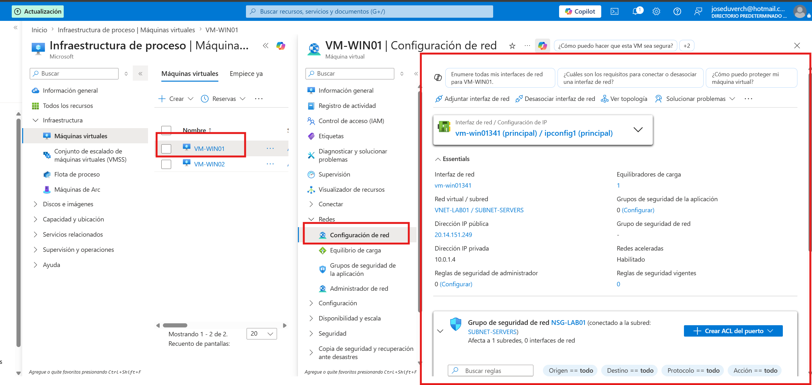

# Proyecto 10 - Azure Network Security Groups (NSG)

## Descripción

En este laboratorio se implementó y administró un **Network Security Group (NSG)** para controlar el tráfico de red hacia las máquinas virtuales de una infraestructura en Azure.

El objetivo fue comprender cómo Azure evalúa las reglas de seguridad según su prioridad, realizar un escenario de bloqueo controlado del puerto HTTP (80) y restaurar el servicio sin afectar la infraestructura.

---

# Objetivos

- Comprender el funcionamiento de Azure Network Security Groups.

- Analizar reglas de entrada y salida.

- Configurar reglas personalizadas.

- Entender el orden de evaluación de prioridades.

- Bloquear y restaurar el acceso HTTP.

- Identificar la diferencia entre un NSG asociado a una Subnet y uno asociado a una NIC.

- Documentar el proceso siguiendo buenas prácticas de administración.

---

# Arquitectura

Internet

    ↓

Azure Load Balancer (LB-LAB01)

      ↓

VNET-LAB01 

      ↓

SUBNET-SERVERS

      ↓

 NSG-LAB01

     ↓

 VM-WIN01
 VM-WIN02

---

# Recursos utilizados

| Recurso | Nombre |
|----------|---------|
| Resource Group | RG-LAB-AZ104 |
| Virtual Network | VNET-LAB01 |
| Subnet | SUBNET-SERVERS |
| Network Security Group | NSG-LAB01 |
| Load Balancer | LB-LAB01 |
| Virtual Machine | VM-WIN01 |
| Virtual Machine | VM-WIN02 |

---

# Reglas existentes

Se analizaron las reglas configuradas en el NSG.

| Prioridad | Regla | Puerto | Acción |
|-----------|---------|---------|---------|
|100|Allow-RDP-MyIP|3389|Allow|
|110|Allow-HTTP|80|Allow|
|65000|AllowVnetInBound|Todos|Allow|
|65001|AllowAzureLoadBalancerInBound|Todos|Allow|
|65500|DenyAllInBound|Todos|Deny|

---

# Desarrollo del laboratorio

## Paso 1

Se revisaron las reglas de entrada existentes del NSG.

---

## Paso 2

Se creó una regla personalizada para bloquear temporalmente el puerto HTTP.

Configuración utilizada:

- Puerto: 80

- Protocolo: TCP

- Acción: Deny

- Prioridad: 105

- Nombre: Deny-HTTP-Test

---

## Paso 3

Después de aplicar la regla, el sitio IIS publicado mediante Azure Load Balancer dejó de responder correctamente.

Esto permitió comprobar el funcionamiento de las prioridades del NSG.

---

## Paso 4

Se verificó que la regla Deny-HTTP-Test quedó aplicada correctamente.

---

## Paso 5

La regla fue eliminada para restaurar el servicio.

El sitio IIS volvió a responder normalmente.

---

## Paso 6

Se revisó la configuración de red de la máquina virtual.

Se comprobó que el NSG se encuentra asociado a la \*\*Subnet\*\* y no directamente a la interfaz de red (NIC).

---

# Explicación técnica

Azure evalúa las reglas de un NSG utilizando la prioridad.

Las prioridades con números más bajos se procesan primero.

Ejemplo:

100 → Allow RDP

105 → Deny HTTP

110 → Allow HTTP

Cuando un paquete destinado al puerto 80 llega al NSG, Azure encuentra primero la regla **Deny HTTP (105)** y deja de evaluar el resto de reglas.

Como consecuencia, la regla **Allow HTTP (110)** nunca llega a aplicarse.

---

# Diferencia entre NSG en Subnet y NIC

## NSG asociado a Subnet

- Protege todos los recursos de la subred.

- Es la práctica más común en entornos empresariales.

- Facilita la administración centralizada.

## NSG asociado a NIC

- Solo afecta a una máquina virtual específica.

- Se utiliza cuando una VM requiere reglas especiales.

En este laboratorio el NSG fue asociado a la Subnet.

---

# Buenas prácticas

- Utilizar prioridades organizadas.

- Restringir el acceso RDP únicamente a direcciones IP autorizadas.

- Evitar reglas Allow demasiado amplias.

- Documentar cualquier cambio antes de aplicarlo.

- Restaurar siempre la configuración original después de realizar pruebas.

---

# Resultado

Se logró:

- Comprender el funcionamiento de Azure Network Security Groups.

- Analizar reglas existentes.

- Implementar reglas personalizadas.

- Bloquear temporalmente el acceso HTTP.

- Restaurar correctamente el servicio.

- Comprender el procesamiento por prioridad de Azure.

---

# Preguntas frecuentes de entrevista

### ¿Cómo procesa Azure las reglas de un NSG?

Azure evalúa las reglas según su prioridad, comenzando por el número más bajo.

---

### ¿Qué sucede si una regla Deny tiene mayor prioridad que una Allow?

La regla Deny será aplicada y Azure dejará de evaluar las reglas restantes.

---

### ¿Cuál es la diferencia entre aplicar un NSG a una Subnet y a una NIC?

Subnet:

Protege todos los recursos de la subred.

NIC:

Solo protege la máquina virtual asociada a esa interfaz.

---

### ¿Qué puertos se utilizaron en este laboratorio?

3389 para administración mediante RDP.

80 para el servicio web IIS.

---

# Tecnologías utilizadas

- Microsoft Azure

- Azure Virtual Network

- Azure Network Security Group

- Azure Load Balancer

- Windows Server

- IIS

---

# Habilidades demostradas

- Administración de Azure Network Security Groups.

- Configuración de reglas Inbound y Outbound.

- Comprensión de prioridades de reglas.

- Diagnóstico y resolución de problemas de conectividad.

- Administración de redes virtuales en Azure.

- Documentación técnica utilizando GitHub.

---

# Autor

José Duver Chero Inga

Proyecto desarrollado como parte del portafolio profesional para Azure Administrator (AZ-104).

