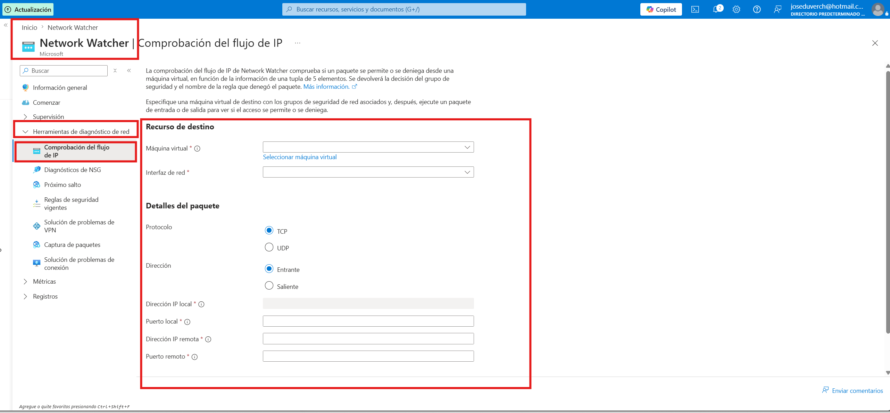
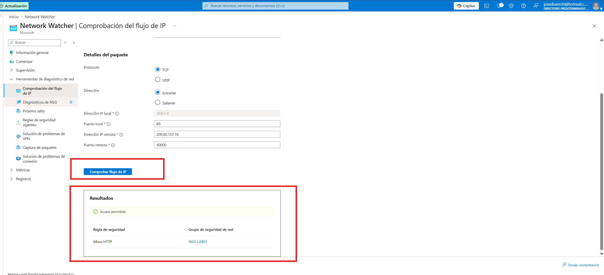
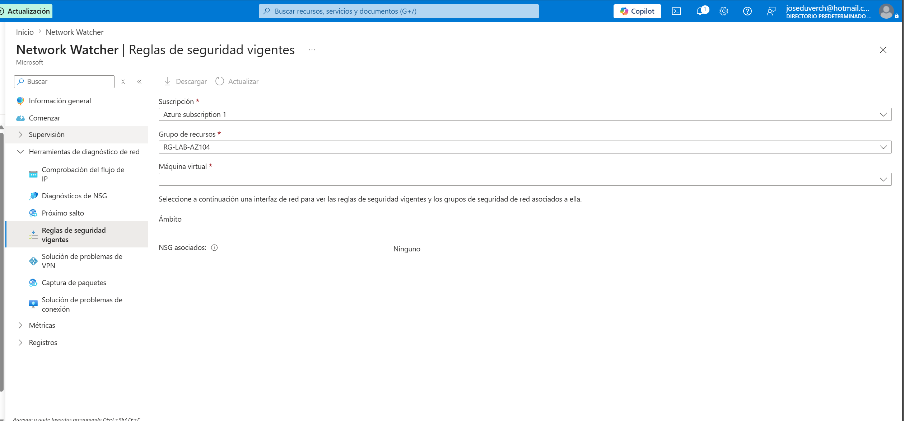
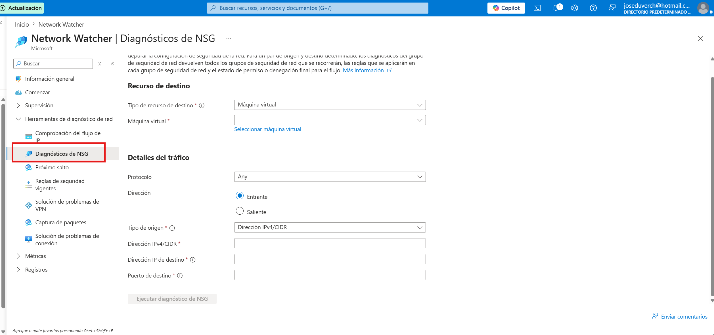
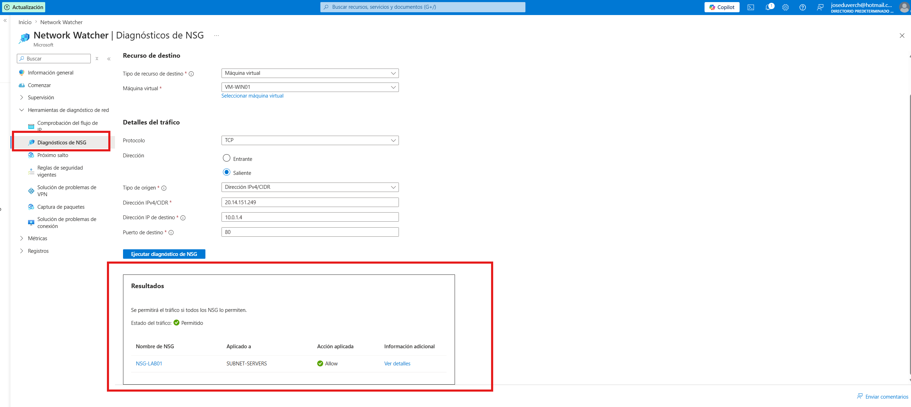
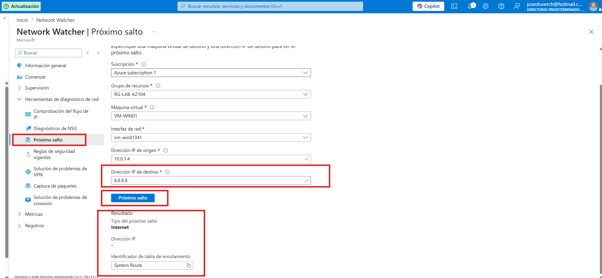

# Proyecto 11 - Azure Network Watcher

## Descripción

En este proyecto utilicé **Azure Network Watcher** para diagnosticar y validar la conectividad de red de una máquina virtual en Azure.

Se realizaron pruebas de flujo de tráfico, validación de reglas del Network Security Group (NSG), diagnóstico de seguridad y verificación de la ruta utilizada por la máquina virtual para acceder a Internet.

Toda la infraestructura utilizada corresponde a los proyectos anteriores del portafolio, reutilizando los mismos recursos para optimizar costos.

---

# Arquitectura utilizada

Se reutilizó la infraestructura existente del laboratorio:

- Grupo de recursos
- Red virtual
- Máquina virtual Windows Server
- Network Security Group (NSG)
- IIS instalado en la máquina virtual

No fue necesario crear nuevas máquinas virtuales.

---

# Servicios de Azure utilizados

- Azure Network Watcher
- Azure Virtual Machine
- Azure Virtual Network
- Network Security Group (NSG)

---

# Recursos utilizados

| Recurso | Nombre |
|----------|---------|
| Grupo de recursos | RG-LAB-AZ104 |
| Máquina virtual | VM-WIN01 |
| Red virtual | VNET-LAB01 |
| Subred | SUBNET-SERVERS |
| NSG | NSG-LAB01 |

---

# Objetivos del laboratorio

- Validar el flujo del tráfico hacia la máquina virtual.
- Verificar qué regla del NSG permite la conexión.
- Diagnosticar problemas de conectividad.
- Analizar la ruta utilizada para acceder a Internet.
- Conocer las principales herramientas de diagnóstico de Azure Network Watcher.

---

# Paso 1 - Abrir Azure Network Watcher

Se accedió al servicio Azure Network Watcher desde el portal de Azure.


---

# Paso 2 - Comprobación del flujo de IP

Se utilizó la herramienta **Comprobación del flujo de IP** para simular una conexión TCP hacia la máquina virtual.

Configuración utilizada:

- Protocolo: TCP
- Puerto: 80
- Máquina virtual: VM-WIN01



---

# Paso 3 - Resultado de la comprobación

Azure evaluó las reglas del Network Security Group y determinó que la conexión estaba permitida.

Resultado obtenido:

- Estado: Permitido
- Regla aplicada: Allow-HTTP



---

# Paso 4 - Reglas de seguridad vigentes

Se verificó que la máquina virtual no tiene un NSG asociado directamente a la interfaz de red.

El grupo de seguridad **NSG-LAB01** está asociado a la subred **SUBNET-SERVERS**, por lo que todas las máquinas de esa subred heredan sus reglas de seguridad.



---

# Paso 5 - Diagnóstico de NSG

Se utilizó la herramienta **Diagnóstico de NSG** para analizar cómo Azure evalúa las reglas de seguridad durante el tránsito del tráfico.



---

# Paso 6 - Resultado del diagnóstico

El diagnóstico confirmó lo siguiente:

- Estado del tráfico: Permitido
- NSG evaluado: NSG-LAB01
- Aplicado sobre: SUBNET-SERVERS



---

# Paso 7 - Próximo salto (Next Hop)

Finalmente se utilizó la herramienta **Próximo salto** para identificar la ruta utilizada por la máquina virtual para llegar a Internet.

Dirección IP utilizada:

```
8.8.8.8
```

Resultado obtenido:

- Tipo de próximo salto: Internet
- Tabla de enrutamiento: System Route



---

# Resultado del laboratorio

Durante este proyecto se comprobó que:

- La regla **Allow-HTTP** permite el acceso al servidor web.
- El Network Security Group funciona correctamente.
- Las reglas del NSG se aplican desde la subred.
- Azure Network Watcher permite diagnosticar problemas de conectividad de forma rápida.
- La máquina virtual utiliza la ruta predeterminada de Azure para acceder a Internet.

---

# Conocimientos adquiridos

Durante este laboratorio aprendí a utilizar las principales herramientas de Azure Network Watcher para diagnosticar problemas de conectividad en una máquina virtual.

Además, pude validar el flujo de tráfico, identificar la regla del NSG responsable de permitir la conexión y verificar la ruta que utiliza Azure para enviar el tráfico hacia Internet.

Estas herramientas son ampliamente utilizadas por los administradores de Azure para resolver incidencias en entornos productivos.

---

# Habilidades demostradas

- Azure Network Watcher
- Diagnóstico de conectividad
- IP Flow Verify
- NSG Diagnostics
- Next Hop
- Azure Virtual Network
- Network Security Group
- Troubleshooting de redes
- Administración de redes en Azure

---

# Estado del proyecto

**Proyecto finalizado.**