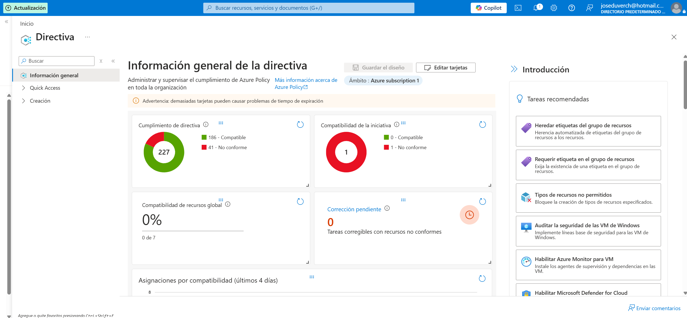
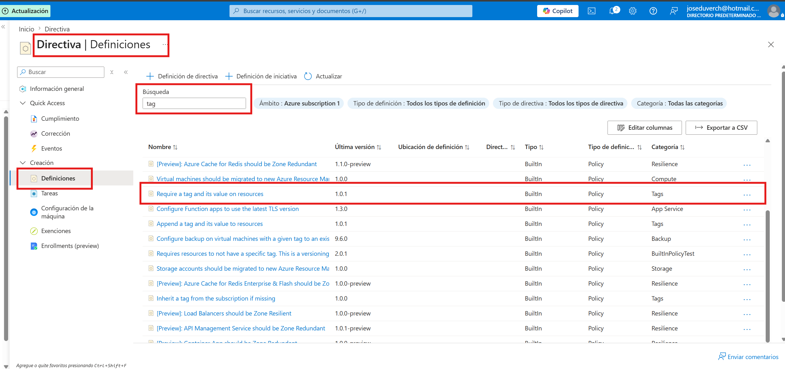
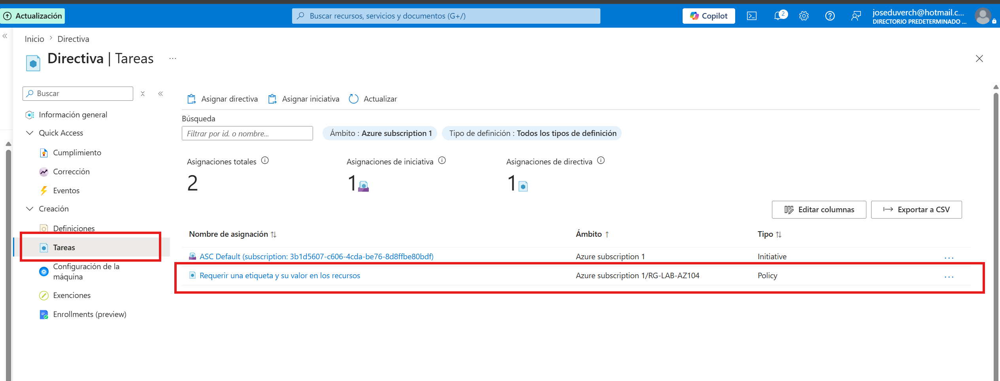
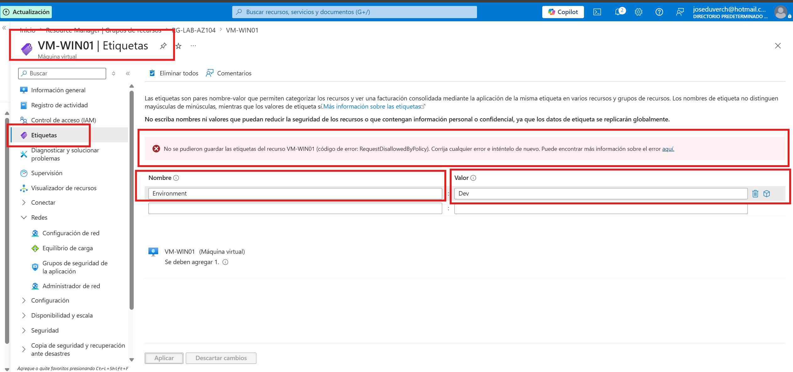

# Proyecto 12 - Azure Policy


## Objetivo


Implementar una política (Azure Policy) para exigir que todos los recursos del laboratorio tengan una etiqueta (Tag) obligatoria llamada **Environment** con el valor **Produccion**, evitando la creación o modificación de recursos que no cumplan con esta regla.


---


## Arquitectura


Azure Subscription

│

└── Resource Group (RG-LAB-AZ104)

│

├── Azure Policy

│ └── Require a tag and its value on resources

│

└── Recursos

├── Virtual Machine

├── Network

├── Storage

└── Otros recursos


---


## Recursos utilizados


- Azure Policy

- Resource Group

- Azure Virtual Machine

- Azure Resource Manager (ARM)

- Tags


---


## Configuración realizada


### 1. Acceso a Azure Policy


Se accedió al servicio **Azure Policy (Directiva)** desde el portal de Azure.


---


### 2. Selección de la política integrada


Se utilizó la definición integrada:


**Require a tag and its value on resources**


Configuración:


| Parámetro | Valor |
|-----------|-------|
| Tag Name | Environment |
| Tag Value | Produccion |
| Effect | Deny |


---


### 3. Asignación de la política


La política fue asignada al Resource Group:


```

RG-LAB-AZ104

```


Con los siguientes parámetros:


| Parámetro | Valor |
|-----------|-------|
| Nombre de etiqueta | Environment |
| Valor | Produccion |
| Efecto | Deny |


---


### 4. Validación


Se intentó modificar las etiquetas de la máquina virtual:


```

VM-WIN01

```


Azure bloqueó la operación mostrando el mensaje:


```

RequestDisallowedByPolicy

```


Lo que confirma que la política fue aplicada correctamente.


---


## Evidencias


### Definición de la Policy






---


### Asignación de la Policy





---


### Validación de la restricción





---


## Resultado


Se logró implementar correctamente una política de Azure que exige la existencia de una etiqueta obligatoria en los recursos.


Cuando un usuario intenta modificar o crear un recurso que incumple la política, Azure bloquea automáticamente la operación mediante el efecto **Deny**, garantizando el cumplimiento de los estándares de gobierno establecidos.


---


## Habilidades adquiridas


- Implementación de Azure Policy

- Asignación de políticas

- Gobernanza de recursos

- Administración de Tags

- Validación de cumplimiento

- Control de cambios mediante políticas

- Azure Resource Manager (ARM)


---


## Estado


Proyecto completado.


**Estado:** ✅ Finalizado

