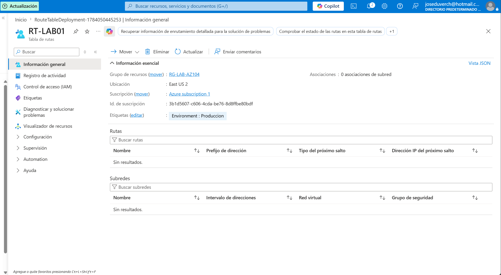
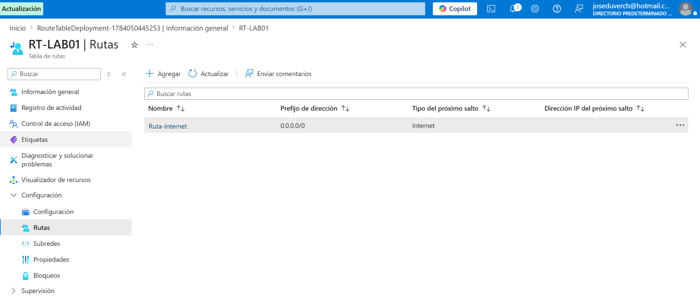
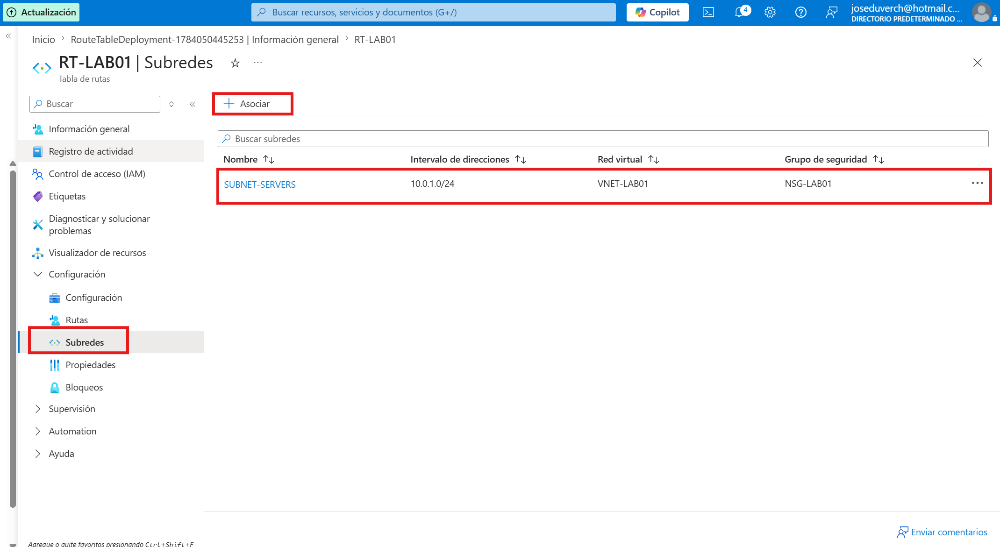
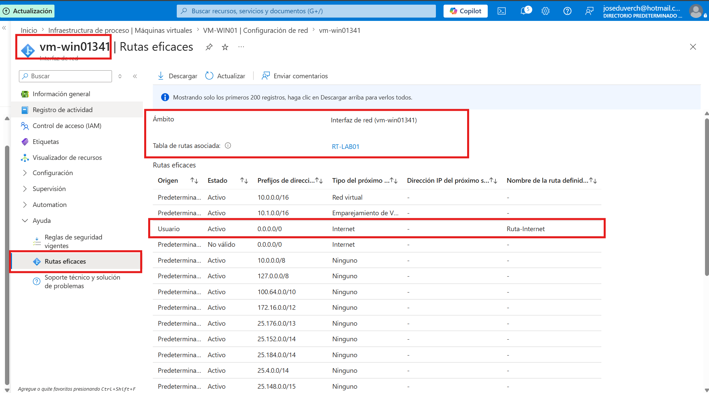
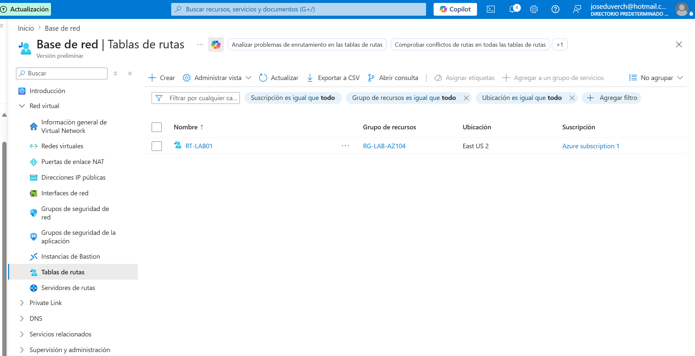

# Proyecto 13 - User Defined Routes (UDR) en Azure


## 📌 Descripción


En este laboratorio se implementó una **User Defined Route (UDR)** utilizando una **Route Table** en Microsoft Azure.


El objetivo fue comprender cómo Azure permite personalizar el enrutamiento del tráfico de red mediante rutas definidas por el usuario, reemplazando o complementando las rutas predeterminadas del sistema.


Además, se validó la correcta aplicación de la ruta utilizando la herramienta \*\*Rutas eficaces (Effective Routes)\*\* sobre la interfaz de red de la máquina virtual.


---


# Objetivos


- Crear una Route Table.

- Crear una User Defined Route (UDR).

- Asociar la Route Table a una subred.

- Verificar que la máquina virtual reciba la nueva ruta.

- Validar el funcionamiento mediante Effective Routes.


---


# Arquitectura


```

Internet

 │

 ▼

+-----------------------+

| User Defined Route    |
| 0.0.0.0/0 → Internet  |
+-----------------------+
         │
         ▼
+-----------------------+
| Route Table           |
| RT-LAB01              |
+-----------------------+

         │
         ▼
+-----------------------+
| SUBNET-SERVERS        |
+-----------------------+

       │
       ▼
+-----------------------+
| VM-WIN01              |
+-----------------------+

```


---


# Recursos utilizados


| Recurso | Nombre |
|---------|--------|
| Resource Group | RG-LAB-AZ104 |
| Virtual Network | VNET-LAB01 |
| Subred | SUBNET-SERVERS |
| Máquina Virtual | VM-WIN01 |
| Route Table | RT-LAB01 |
| Ruta UDR | Ruta-Internet |


\---


# Configuración realizada


## Route Table


| Configuración | Valor |
|--------------|-------|
| Nombre | RT-LAB01 |
| Región | East US 2 |
| Propagación BGP | Habilitada |


---


## Ruta creada


| Parámetro | Valor |
|-----------|-------|
| Nombre | Ruta-Internet |
| Prefijo de destino | 0.0.0.0/0 |
| Tipo del próximo salto | Internet |


--


## Asociación


La Route Table **RT-LAB01** fue asociada a la subred:


```

SUBNET-SERVERS

```


perteneciente a la red virtual:


```

VNET-LAB01

```


---


# Validación


La validación se realizó utilizando la herramienta **Rutas eficaces (Effective Routes)** sobre la interfaz de red de la máquina virtual.


Se comprobó que Azure aplicó correctamente la ruta definida por el usuario.


Resultado observado:


| Origen | Estado | Destino | Próximo salto |
|---------|---------|----------|---------------|
| Usuario | Activo | 0.0.0.0/0 | Internet |


Esto confirma que la User Defined Route está siendo utilizada por la interfaz de red.


---


# Evidencias


## 1. Creación de la Route Table





---


## 2. Creación de la ruta UDR





---


## 3. Asociación de la Route Table a la subred





---


## 4. Validación mediante Effective Routes





---


## 5. Validación final de la Route Table





---


# Aprendizajes


Durante este laboratorio aprendí a:


- Crear una Route Table en Azure.

- Implementar una User Defined Route.

- Comprender cómo Azure procesa las rutas del sistema y las rutas personalizadas.

- Asociar una Route Table a una subred.

- Utilizar Effective Routes para validar el enrutamiento efectivo de una máquina virtual.

- Interpretar el origen de las rutas (Sistema vs Usuario).


---


# Conclusión


Las **User Defined Routes (UDR)** permiten controlar el flujo del tráfico dentro de una red virtual de Azure, ofreciendo mayor flexibilidad para implementar arquitecturas de red personalizadas.


La validación mediante **Effective Routes** confirmó que la ruta configurada fue aplicada correctamente a la interfaz de red de la máquina virtual, verificando el correcto funcionamiento de la Route Table.


---


## Estado del proyecto


**Proyecto completado.**


✅ Route Table creada.


✅ User Defined Route configurada.


✅ Asociación a la subred realizada.


✅ Validación mediante Effective Routes.


✅ Documentación finalizada.

