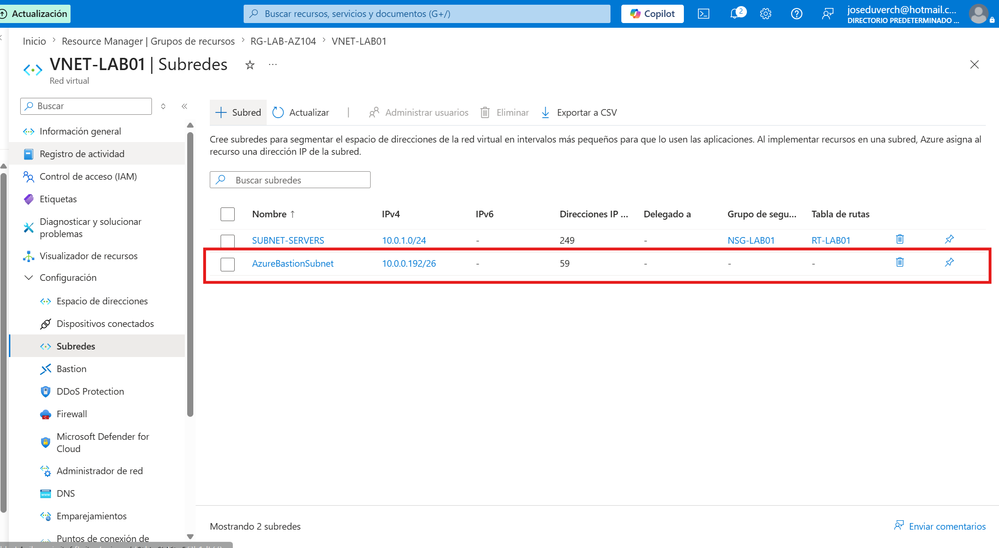
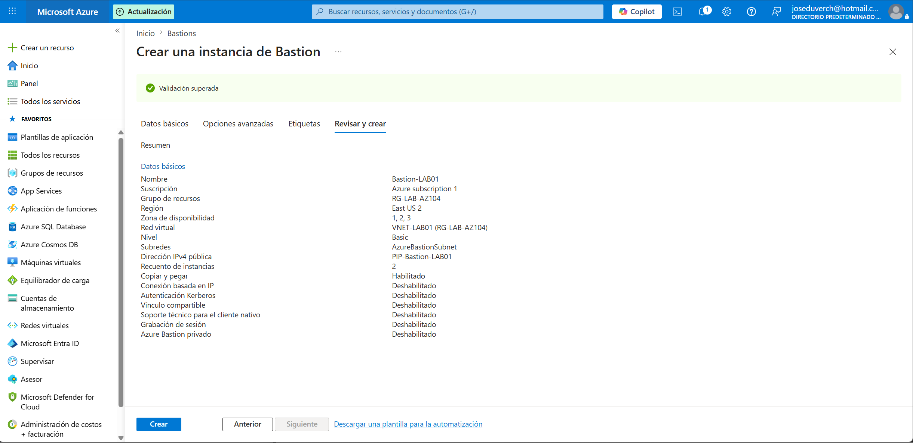
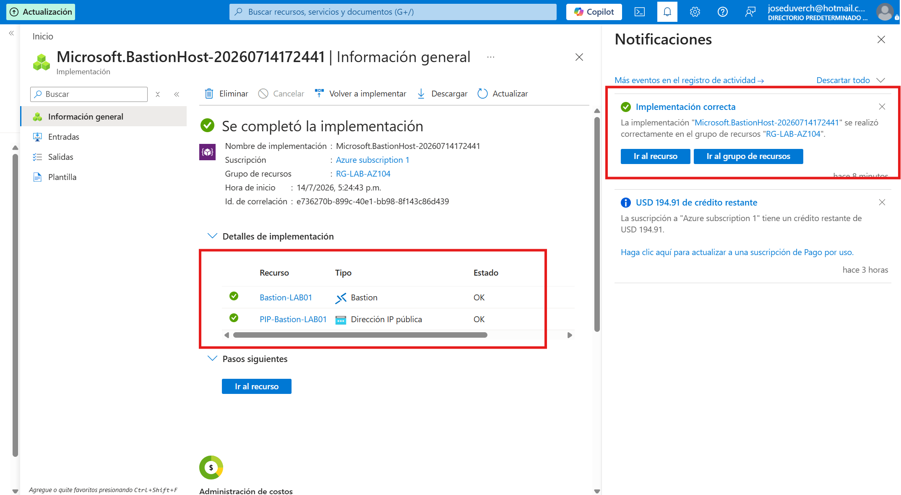
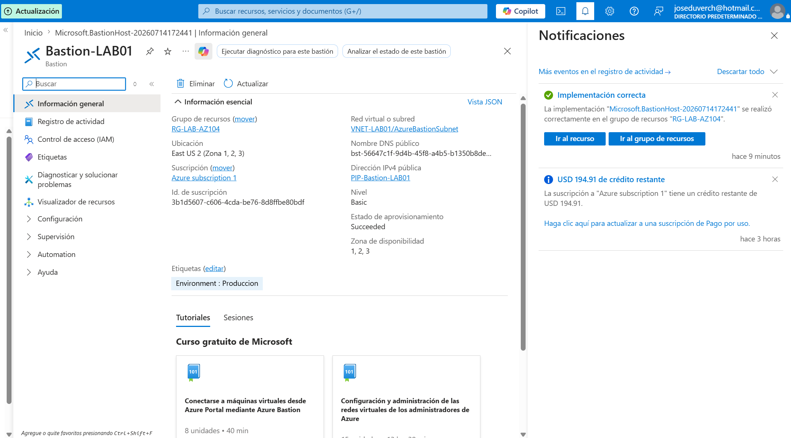
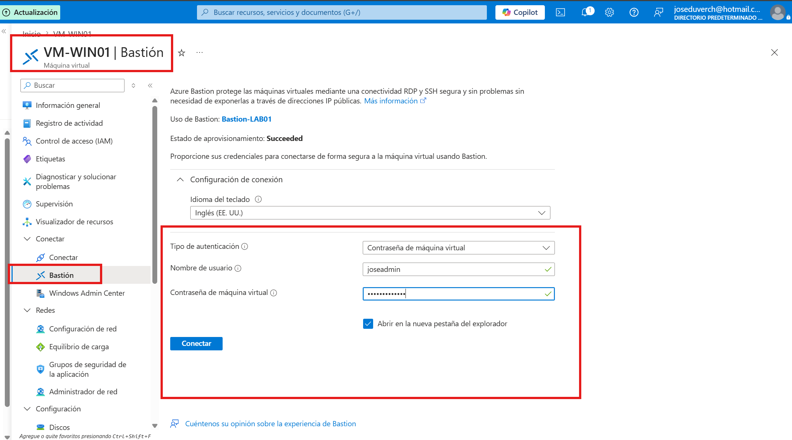
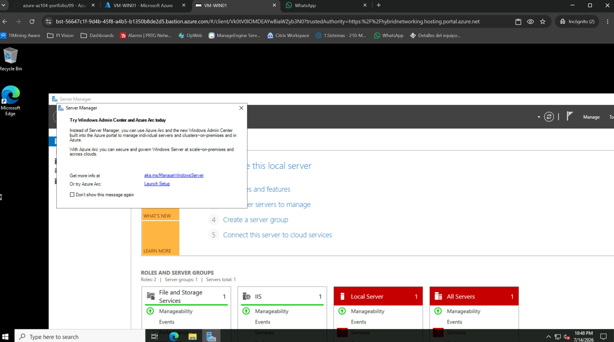

# Proyecto 14 - Azure Bastion


## Objetivo


Implementar **Azure Bastion** para administrar una máquina virtual de Azure de forma segura, sin exponer el puerto RDP (3389) a Internet. La conexión se realiza directamente desde el portal de Azure mediante HTTPS, reduciendo la superficie de ataque y mejorando la seguridad del entorno.


---


# Arquitectura


```

Internet

  │
  ▼

Azure Portal

 │
 ▼

Azure Bastion

 │
 ▼

AzureBastionSubnet

 │
 ▼

VNET-LAB01

   │
   ▼

VM-WIN01

```


---


# Recursos utilizados


| Recurso | Nombre |
|----------|---------|
| Grupo de recursos | RG-LAB-AZ104 |
| Azure Bastion | Bastion-LAB01 |
| Red Virtual | VNET-LAB01 |
| Subred | AzureBastionSubnet |
| Máquina Virtual | VM-WIN01 |
| Dirección IP Pública | PIP-Bastion-LAB01 |


---


# Requisitos previos


Antes de implementar Azure Bastion fue necesario:


- Contar con una Red Virtual (**VNET-LAB01**).

- Crear la subred dedicada **AzureBastionSubnet**.

- Disponer de una Dirección IP Pública Standard.

- Configurar la etiqueta **Environment = Produccion**, requerida por la Azure Policy implementada en el laboratorio.


---


# Configuración


## Azure Bastion


| Parámetro | Valor |
|-----------|-------|
| Nivel | Basic |
| Región | East US 2 |
| Red Virtual | VNET-LAB01 |
| Subred | AzureBastionSubnet |
| Dirección IP Pública | PIP-Bastion-LAB01 |


---


# Implementación


Se implementó Azure Bastion utilizando la red virtual existente **VNET-LAB01**, creando previamente la subred obligatoria **AzureBastionSubnet**.


Una vez finalizada la implementación, Azure Bastion quedó listo para administrar la máquina virtual **VM-WIN01** desde el navegador sin necesidad de utilizar RDP mediante una dirección IP pública.


---


# Validación


Se realizaron las siguientes comprobaciones:


- ✅ Creación correcta de la subred AzureBastionSubnet.

- ✅ Implementación exitosa de Azure Bastion.

- ✅ Asociación correcta con VNET-LAB01.

- ✅ Acceso exitoso a VM-WIN01 desde Azure Portal.

- ✅ Conexión realizada sin utilizar el puerto RDP (3389).

- ✅ Administración segura mediante HTTPS.


---


# Capturas


## 1. Creación de la subred AzureBastionSubnet


Se creó la subred requerida para implementar Azure Bastion.





---


## 2. Validación antes de la implementación


Configuración revisada antes de crear el recurso Azure Bastion.





---


## 3. Implementación completada


Azure Bastion implementado correctamente.





---


## 4. Vista general del recurso


Información general del recurso **Bastion-LAB01**, mostrando la configuración implementada.





---


## 5. Inicio de sesión mediante Bastion


Autenticación para acceder a la máquina virtual desde Azure Portal.





---


## 6. Conexión exitosa


Sesión establecida correctamente con **VM-WIN01** mediante Azure Bastion.





---


# Beneficios de Azure Bastion


- Acceso seguro mediante HTTPS.

- No requiere abrir el puerto RDP (3389) ni SSH (22).

- Reduce significativamente la superficie de ataque.

- Administración centralizada desde Azure Portal.

- Compatible con máquinas virtuales Windows y Linux.

- Elimina la necesidad de utilizar direcciones IP públicas para la administración remota.


---


# Conocimientos adquiridos


Durante este laboratorio aprendí a:


- Implementar Azure Bastion.

- Crear la subred obligatoria AzureBastionSubnet.

- Configurar una dirección IP pública Standard.

- Comprender la arquitectura de Azure Bastion.

- Administrar máquinas virtuales directamente desde Azure Portal.

- Aplicar buenas prácticas de seguridad evitando la exposición de puertos de administración a Internet.


---


# Problemas encontrados


Durante la implementación se presentaron dos inconvenientes:


### 1. Azure Policy


La implementación fue bloqueada inicialmente porque la suscripción tenía una política que exigía la etiqueta:


```

Environment = Produccion

```


Después de agregar la etiqueta requerida, la implementación continuó correctamente.


### 2. Límite de Direcciones IP Públicas


Inicialmente Azure no permitió crear Azure Bastion debido a que la suscripción había alcanzado el límite de direcciones IP públicas disponibles.


La solución consistió en eliminar la máquina virtual **VM-WIN02** y los recursos asociados (NIC, disco e IP pública), liberando la cuota necesaria para completar el laboratorio.


---


# Resultado


✅ Proyecto completado exitosamente.


Azure Bastion quedó implementado y validado correctamente, permitiendo el acceso seguro a **VM-WIN01** desde el navegador mediante Azure Portal, sin necesidad de exponer el puerto RDP (3389) a Internet.


Este laboratorio permitió comprender una de las mejores prácticas de seguridad recomendadas por Microsoft para la administración de máquinas virtuales en Azure.

