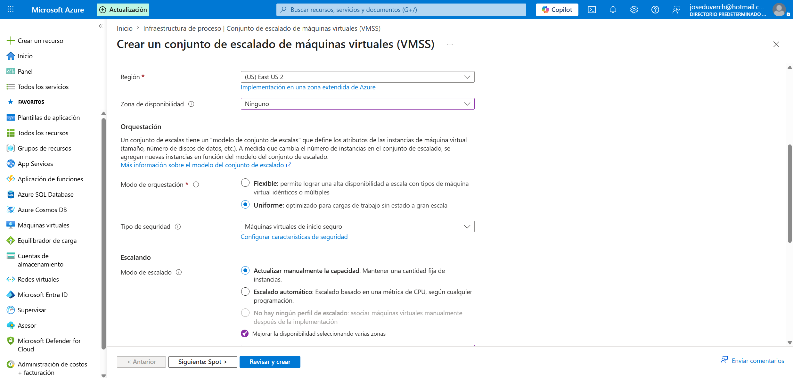
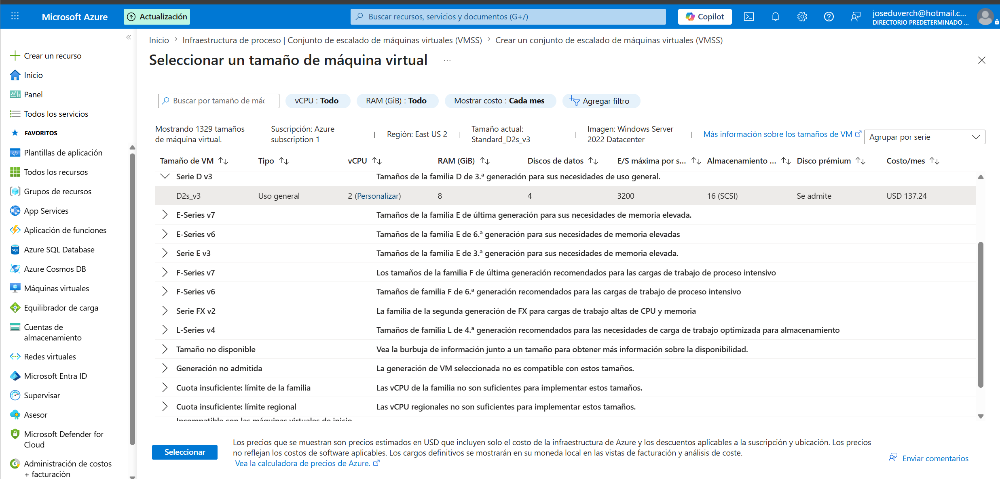
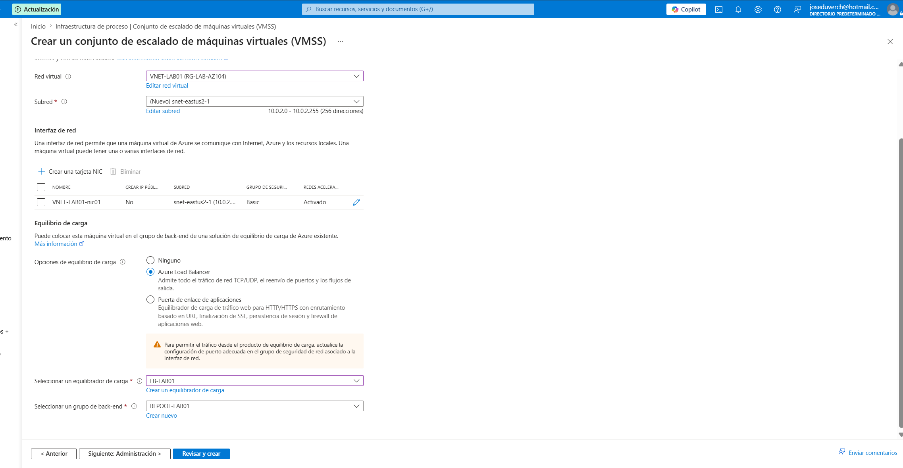
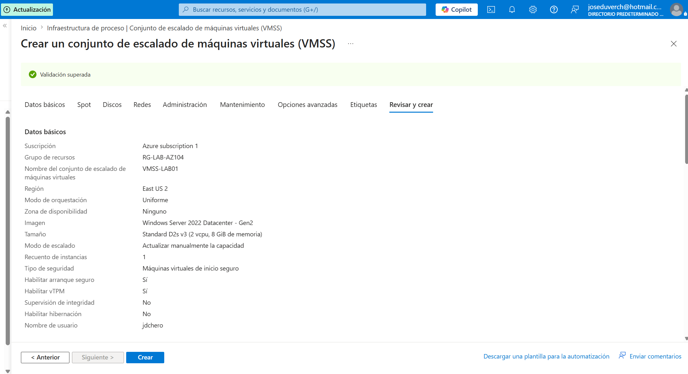
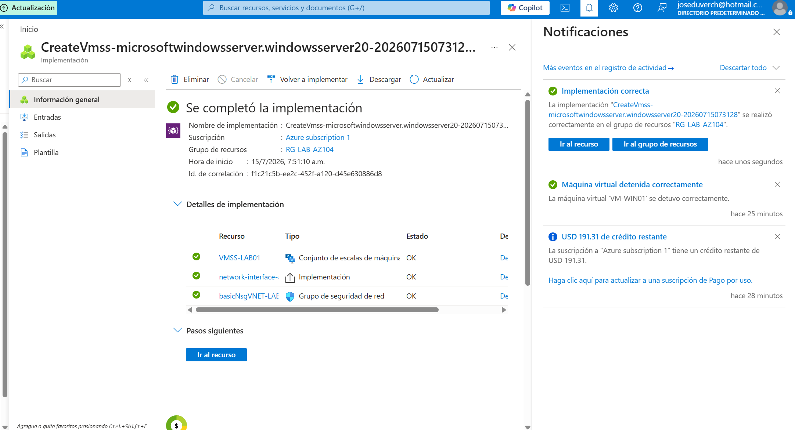
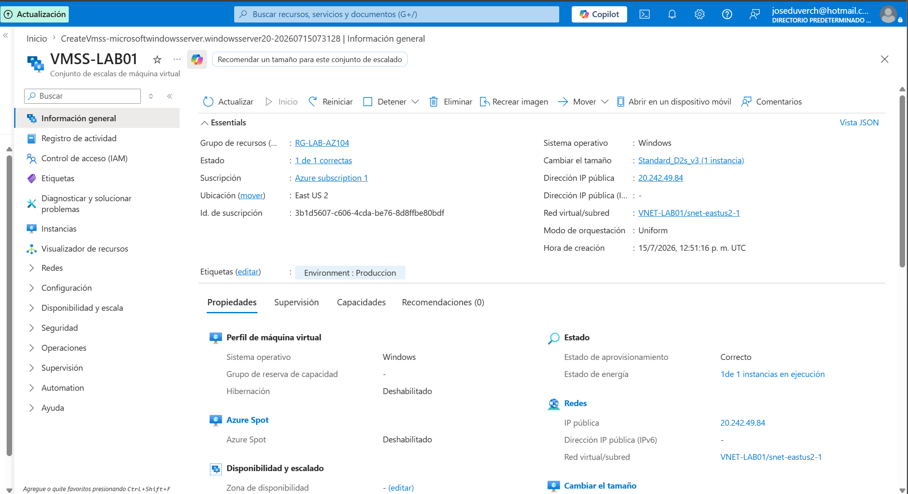
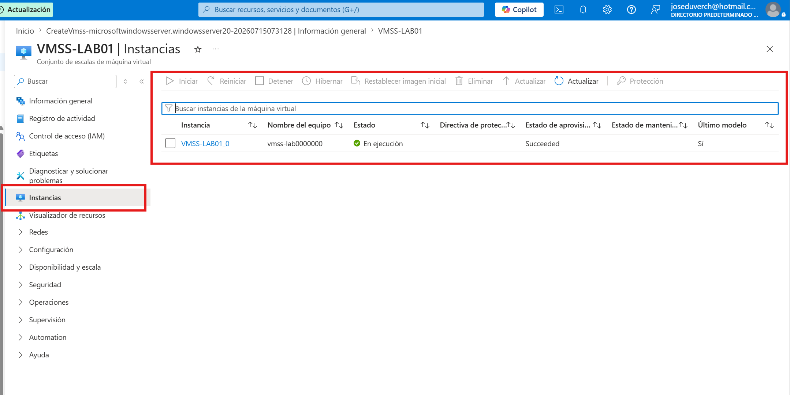

# Proyecto 15 - Virtual Machine Scale Sets (VMSS)


## Objetivo


Implementar un **Virtual Machine Scale Set (VMSS)** para administrar un conjunto de máquinas virtuales idénticas de forma centralizada, facilitando la escalabilidad y alta disponibilidad de las aplicaciones.


---


# Arquitectura


```

                   Internet

                       │

                       ▼

               Azure Load Balancer

                  (LB-LAB01)

                       │

                       ▼

            Backend Pool (BEPOOL-LAB01)

                       │

                       ▼

       Virtual Machine Scale Set (VMSS-LAB01)

                       │

                       ▼

                 VNET-LAB01

```


---


# Recursos utilizados


| Recurso | Nombre |
|----------|---------|
| Grupo de recursos | RG-LAB-AZ104 |
| Virtual Machine Scale Set | VMSS-LAB01 |
| Virtual Network | VNET-LAB01 |
| Load Balancer | LB-LAB01 |
| Backend Pool | BEPOOL-LAB01 |
| Imagen | Windows Server 2022 Datacenter x64 Gen2 |
| Tamaño | Standard_D2s_v3 |


---


# Configuración


## Virtual Machine Scale Set


| Parámetro | Valor |
|-----------|-------|
| Región | East US 2 |
| Orquestación | Uniforme |
| Escalado | Manual |
| Instancias iniciales | 1 |
| Sistema operativo | Windows Server 2022 |
| Tamaño | Standard_D2s_v3 |


---


# Configuración de red


| Parámetro | Valor |
|-----------|-------|
| Virtual Network | VNET-LAB01 |
| Load Balancer | LB-LAB01 |
| Backend Pool | BEPOOL-LAB01 |


---


# Implementación


Se implementó un Virtual Machine Scale Set utilizando la red virtual existente **VNET-LAB01**, reutilizando el **Azure Load Balancer (LB-LAB01)** y el **Backend Pool (BEPOOL-LAB01)** creados previamente en el Proyecto 08.


Durante la configuración se agregó la etiqueta **Environment = Produccion** para cumplir con la Azure Policy implementada en el laboratorio.


---


# Validación


Se verificó correctamente que:


- ✅ El VM Scale Set fue creado correctamente.

- ✅ La implementación finalizó sin errores.

- ✅ El conjunto contiene una instancia inicial.

- ✅ El VMSS quedó asociado al Load Balancer existente.

- ✅ El Backend Pool quedó configurado correctamente.

- ✅ La implementación cumplió con la Azure Policy.


---


# Capturas


## 1. Configuración inicial





---


## 2. Selección del tamaño





---


## 3. Configuración de red





---


## 4. Validación antes de la implementación





---


## 5. Implementación completada





---


## 6. Vista general





---


## 7. Lista de instancias





---


# Beneficios de Virtual Machine Scale Sets


- Administración centralizada de múltiples máquinas virtuales.

- Escalabilidad horizontal.

- Integración con Azure Load Balancer.

- Alta disponibilidad.

- Administración simplificada.


---


# Conocimientos adquiridos


Durante este laboratorio aprendí a:


- Implementar un Virtual Machine Scale Set.

- Configurar el modo de orquestación uniforme.

- Asociar un VMSS a un Azure Load Balancer existente.

- Utilizar Backend Pools.

- Comprender la administración centralizada de instancias.

- Integrar varios servicios de Azure dentro de una misma arquitectura.


---


# Problemas encontrados


## Límite de cuota de vCPU


Inicialmente no fue posible crear el Virtual Machine Scale Set debido a que la suscripción había alcanzado el límite disponible para el tamaño **Standard_D2s_v3**.


La solución consistió en eliminar la máquina virtual **VM-WIN02** y sus recursos asociados (NIC, disco e IP pública), liberando la cuota necesaria para completar la implementación.


## Azure Policy


La política de Azure exigía que todos los recursos incluyeran la etiqueta:


```

Environment = Produccion

```


Después de agregar la etiqueta requerida, la implementación se completó correctamente.


---


# Resultado


✅ Proyecto completado exitosamente.


Se implementó un **Virtual Machine Scale Set** integrado con el **Azure Load Balancer** previamente configurado, reutilizando recursos existentes y simulando una arquitectura de producción basada en escalabilidad y alta disponibilidad.

