# Proyecto 16 - Azure VPN Gateway

## Objetivo

Implementar un **Azure VPN Gateway** para proporcionar conectividad segura entre redes virtuales de Azure y entornos locales (**on-premises**) utilizando una **Virtual Network Gateway**.

---

# Arquitectura

```text
Suscripción de Azure

↓

Grupo de recursos

↓

VNET-LAB01

├── Subred

├── GatewaySubnet

↓

VPN Gateway

↓

Public IP
```

---

# Recursos utilizados

| Recurso | Nombre |
|----------|----------------|
| Virtual Network | VNET-LAB01 |
| Gateway Subnet | GatewaySubnet |
| VPN Gateway | VPNGW-LAB01 |
| Public IP | PIP-VPNGW01 |

---

# Implementación

## Paso 1

Se creó una **Public IP** dedicada.

**Recurso:**

PIP-VPNGW01


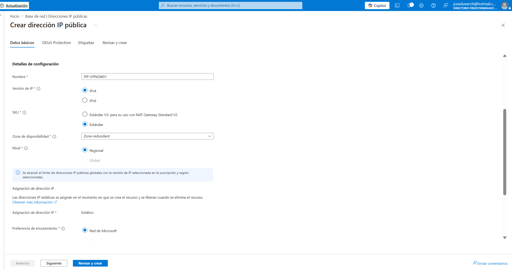

---

## Paso 2

Se aplicó la etiqueta requerida por **Azure Policy**.

**Etiqueta:**

`Environment = Produccion`


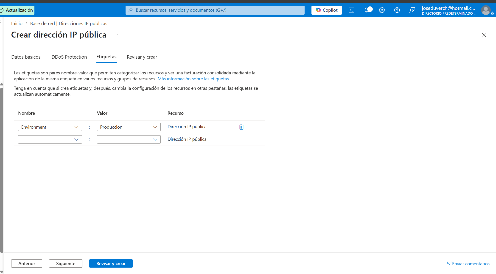

---

## Paso 3

Se validó la configuración de la **Public IP** antes de completar la implementación.


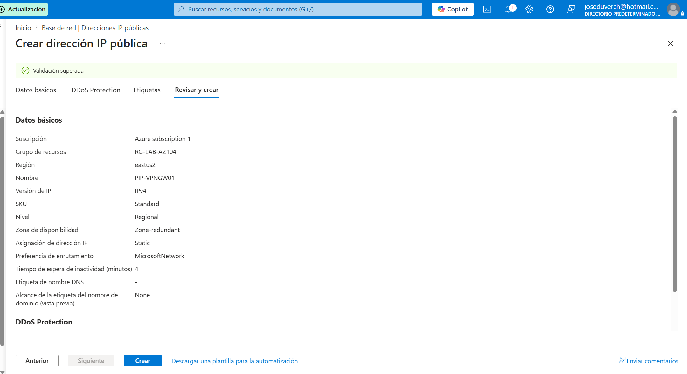

---

## Paso 4

La **Public IP** fue implementada correctamente.


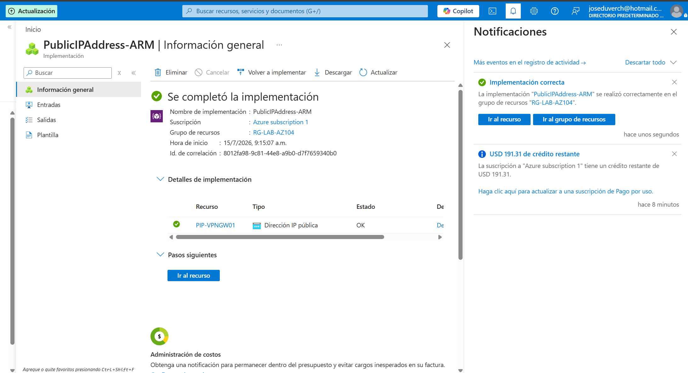

---

## Paso 5

Se creó la subred obligatoria **GatewaySubnet**.

**Red virtual:**

VNET-LAB01

**Subred:**

GatewaySubnet

**Espacio de direcciones:**

10.0.255.0/27


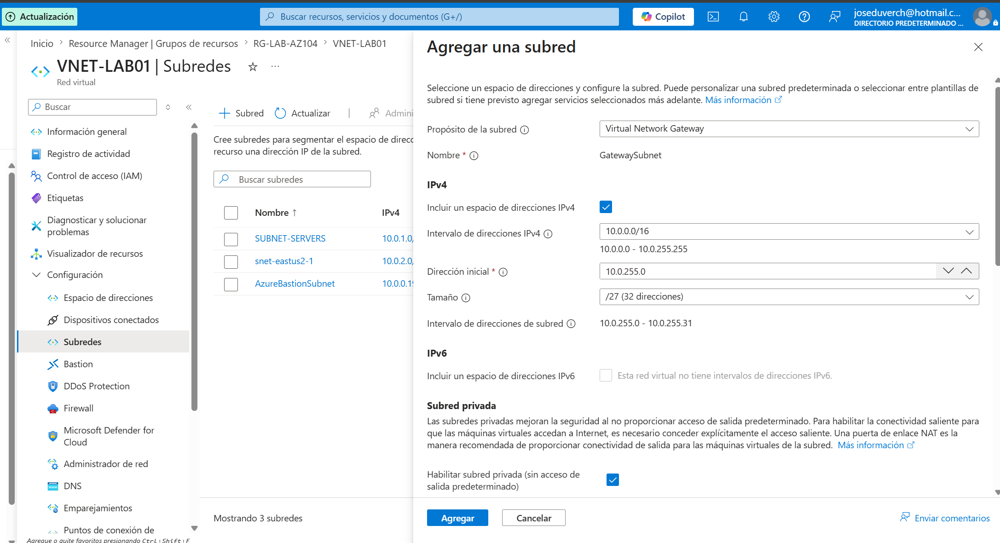

---

## Paso 6

La **GatewaySubnet** fue implementada correctamente.


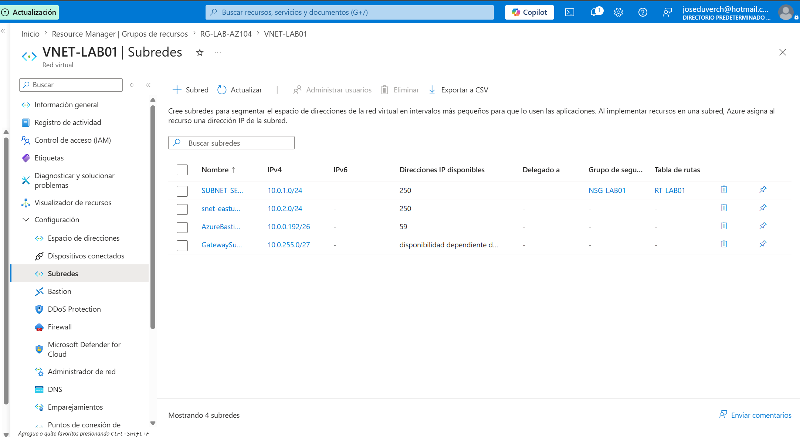

---

## Paso 7

Se configuró el **Azure VPN Gateway**.

**Recurso:**

VPNGW-LAB01


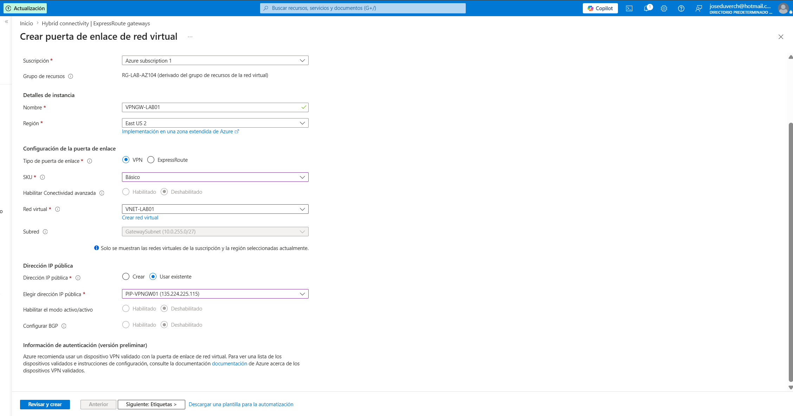

---

## Paso 8

Se aplicaron las etiquetas requeridas.

**Etiqueta:**

`Environment = Produccion`


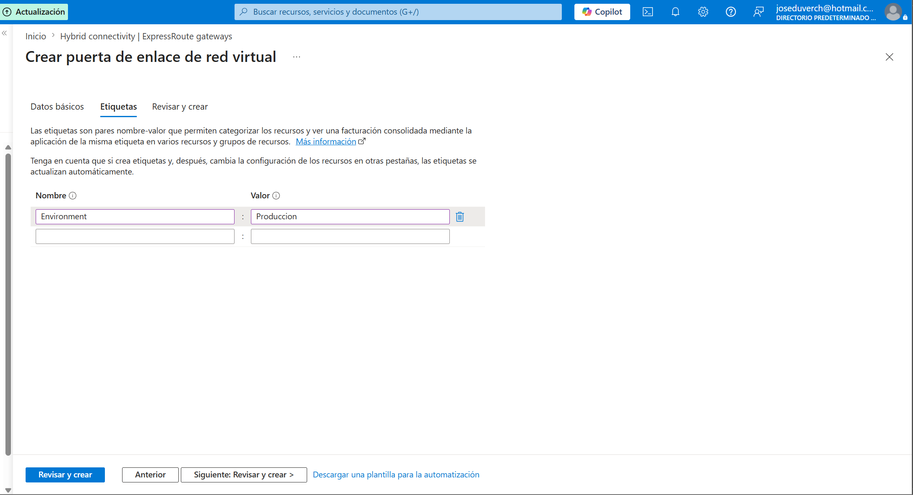

---

## Paso 9

La validación de la implementación finalizó correctamente.


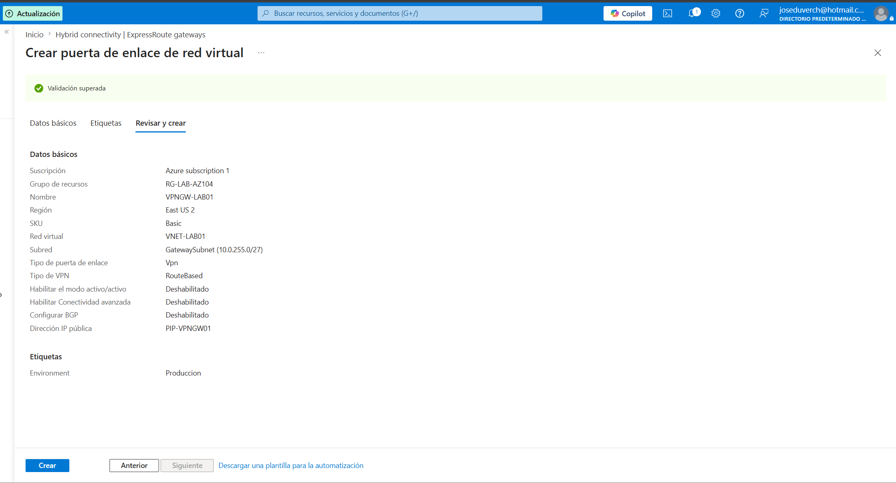

---

## Paso 10

La implementación del **VPN Gateway** se completó correctamente.


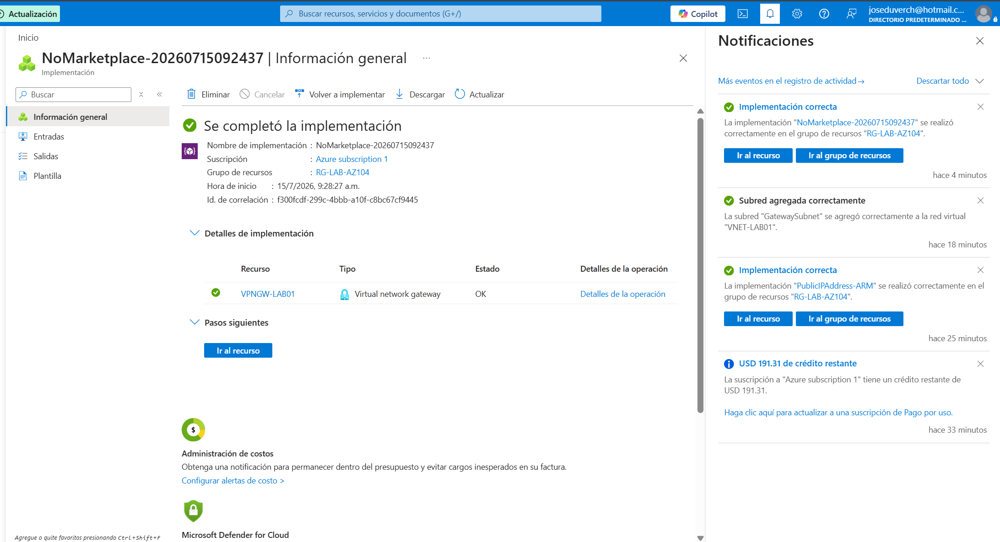

---

## Paso 11

Vista general del **VPN Gateway**.


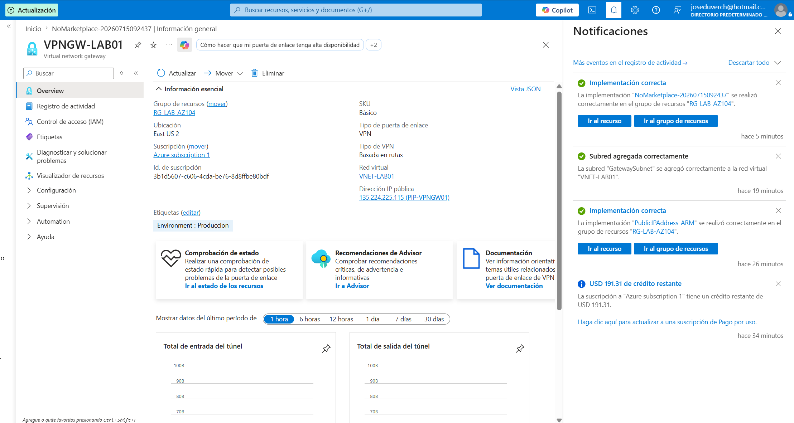

---

# Desafío encontrado

La **Azure Policy** creada en el Proyecto 12 requería que todos los recursos contuvieran la siguiente etiqueta:

```text
Environment = Produccion
```

Durante la implementación del **Azure VPN Gateway**, Azure puede crear automáticamente un recurso **Public IP** si no se proporciona uno existente.

El recurso creado automáticamente no hereda las etiquetas personalizadas, provocando que **Azure Policy** rechazara la implementación.

Además, la suscripción había alcanzado el límite máximo permitido de recursos **Public IP**.

---

# Solución

El problema fue resuelto mediante las siguientes acciones:

- Se eliminó **Azure Bastion** para liberar una cuota de Public IP.
- Se creó manualmente la **Public IP**.
- Se aplicó la etiqueta requerida por **Azure Policy**.
- Se creó la **GatewaySubnet** requerida.
- Se reutilizó la **Public IP** existente durante la implementación del **VPN Gateway**.

---

# Habilidades demostradas

- Azure Networking
- Azure VPN Gateway
- Virtual Network Gateway
- GatewaySubnet
- Azure Policy
- Public IP Management
- Solución de problemas en implementaciones de Azure
- Gestión de dependencias entre recursos
- Validación de infraestructura

---

# Resultado

Se implementó correctamente un **Azure VPN Gateway** utilizando una **Public IP** existente y cumpliendo con los requisitos definidos por **Azure Policy**.