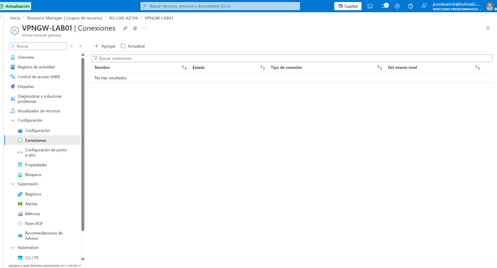

# Proyecto 16 - Azure VPN Gateway

## Objetivo

Implementar un **Azure VPN Gateway** para habilitar conectividad híbrida segura entre Azure y una red local (On-Premises). Durante este laboratorio se configuró una puerta de enlace VPN, una **GatewaySubnet**, una dirección IP pública y se resolvieron problemas reales relacionados con Azure Policy y límites de la suscripción.

---

# Arquitectura

```
Azure Subscription
        │
        ▼
RG-LAB-AZ104
        │
        ▼
VNET-LAB01
        │
 ┌────────────────┐
 │ GatewaySubnet  │
 └────────────────┘
        │
        ▼
VPNGW-LAB01
        │
        ▼
PIP-VPNGW01
```

---

# Recursos utilizados

| Recurso | Nombre |
|----------|----------------|
| Grupo de recursos | RG-LAB-AZ104 |
| Red Virtual | VNET-LAB01 |
| Gateway Subnet | GatewaySubnet |
| VPN Gateway | VPNGW-LAB01 |
| Dirección IP Pública | PIP-VPNGW01 |

---

# Implementación

## Paso 1 - Configuración inicial del VPN Gateway

Se configuró una puerta de enlace de tipo **VPN** utilizando el SKU **Básico**.


---

## Paso 2 - Etiquetas del recurso

Se aplicó la etiqueta requerida por Azure Policy.

**Environment = Produccion**


---

## Paso 3 - Creación de la Dirección IP Pública

Debido a una restricción encontrada durante el despliegue automático, fue necesario crear manualmente la dirección IP pública.


---

## Paso 4 - Aplicación de etiquetas

Se agregó la etiqueta requerida por Azure Policy.


---

## Paso 5 - Validación de la Dirección IP Pública

Se revisó la configuración antes de iniciar la implementación.


---

## Paso 6 - Dirección IP Pública creada

La dirección IP pública fue creada correctamente.


---

## Paso 7 - Creación de GatewaySubnet

Se creó la subred obligatoria **GatewaySubnet** dentro de **VNET-LAB01** con el rango:

**10.0.255.0/27**


---

## Paso 8 - GatewaySubnet creada

Se verificó la creación correcta de la subred.


---

## Paso 9 - Validación de implementación

Azure validó correctamente todos los recursos antes del despliegue.


---

## Paso 10 - Implementación completada

La implementación del VPN Gateway finalizó correctamente.


---

## Paso 11 - Información general del recurso

Vista general del recurso una vez finalizada la implementación.


---

## Paso 12 - Validación de conexiones

Se verificó que el recurso quedó listo para futuras conexiones **Site-to-Site** o **Point-to-Site**.

Actualmente no existen conexiones configuradas debido a que aún no se ha implementado una red local (On-Premises) o un **Local Network Gateway**.



---

# Problemas encontrados

Durante la implementación se presentaron distintos inconvenientes que fueron solucionados.

## 1. Azure Policy

La suscripción tenía configurada una política que exigía la siguiente etiqueta en todos los recursos:

**Environment = Produccion**

El asistente de Azure VPN Gateway no aplicaba automáticamente esta etiqueta a la dirección IP pública, provocando el bloqueo de la implementación.

---

## 2. Límite de Direcciones IP Públicas

La suscripción tenía ocupadas las tres direcciones IP públicas permitidas:

- VM-WIN01-ip
- PIP-LB01
- PIP-Bastion-LAB01

Para continuar fue necesario eliminar Azure Bastion y liberar una dirección IP pública.

---

## 3. GatewaySubnet

La implementación no podía continuar hasta crear la subred obligatoria **GatewaySubnet**.

---

# Solución aplicada

Para completar correctamente el despliegue se realizaron las siguientes acciones:

- Eliminación temporal de Azure Bastion para liberar una IP pública.
- Creación manual de la dirección IP pública.
- Aplicación de la etiqueta requerida por Azure Policy.
- Creación de GatewaySubnet.
- Asociación de la IP pública existente al VPN Gateway.

---

# Conocimientos adquiridos

Durante este laboratorio se reforzaron los siguientes conceptos:

- Azure VPN Gateway
- GatewaySubnet
- Azure Networking
- Azure Policy
- Azure Public IP
- Resolución de problemas en implementaciones
- Dependencias entre recursos
- Conectividad híbrida

---

# Resultado

Se implementó correctamente un **Azure VPN Gateway** funcional y preparado para futuras conexiones **Site-to-Site** o **Point-to-Site**.

Además, se resolvieron problemas reales relacionados con Azure Policy, límites de la suscripción y dependencias de red, fortaleciendo la experiencia práctica en la administración de infraestructura Azure.