# Proyecto 18 - Microsoft Entra ID


## Objetivo


Administrar identidades en Microsoft Entra ID mediante la creación de usuarios, grupos de seguridad y asignación de roles administrativos.


Durante este laboratorio se realizaron tareas comunes de administración de identidades que forman parte del trabajo diario de un Azure Administrator.


---


# Arquitectura


```

Microsoft Entra ID

       │

       ▼

Usuario

usuario.lab

       │

       ▼

Grupo de Seguridad

GRP-Administradores-LAB

       │

       ▼

Rol

Lectores de directorios

```


---


# Recursos utilizados


| Recurso | Nombre |
|----------|-----------------------------|
| Usuario | usuario.lab |
| Grupo de Seguridad | GRP-Administradores-LAB |
| Rol | Lectores de directorios |


---


# Implementación


## Paso 1 - Acceso a Microsoft Entra ID


Se ingresó al servicio Microsoft Entra ID desde el portal de Azure.


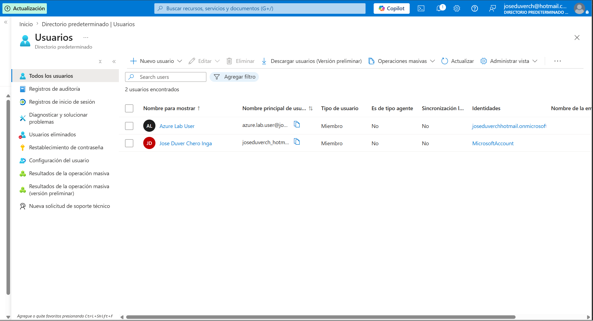


---


## Paso 2 - Creación del usuario


Se creó un usuario para el laboratorio.


**Nombre de usuario**


```

usuario.lab

```


**Nombre para mostrar**


```

Usuario Laboratorio

```


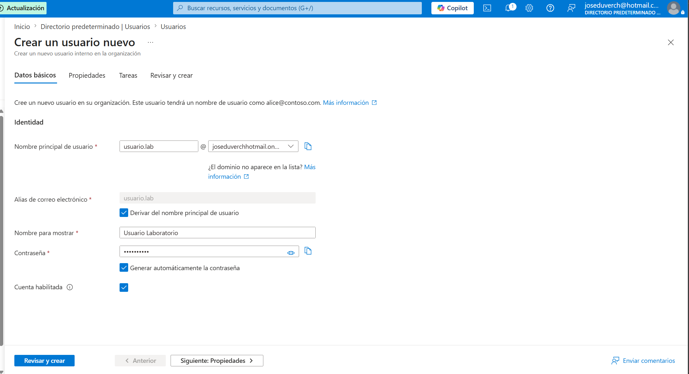


---


## Paso 3 - Usuario creado


Se verificó que el usuario fue creado correctamente.


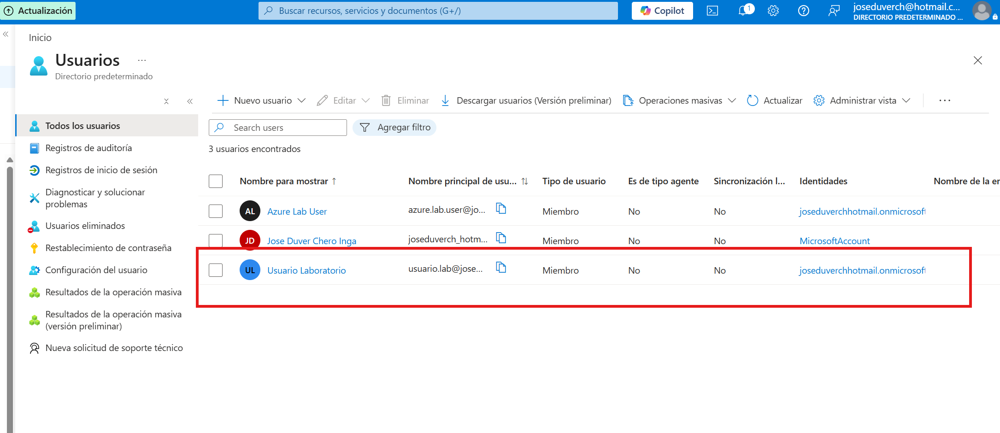


---


## Paso 4 - Creación del grupo


Se creó un grupo de seguridad.


**Nombre**


```

GRP-Administradores-LAB

```


Tipo:


- Seguridad

- Asignación manual


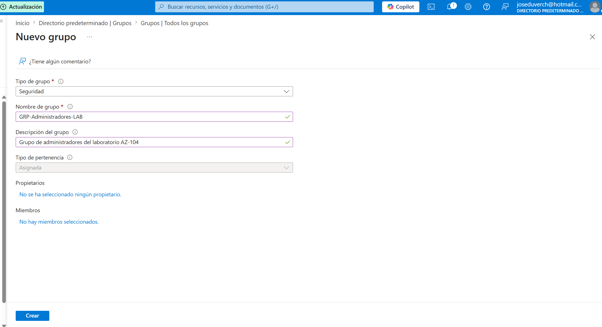


---


## Paso 5 - Grupo creado


Se confirmó la creación del grupo.


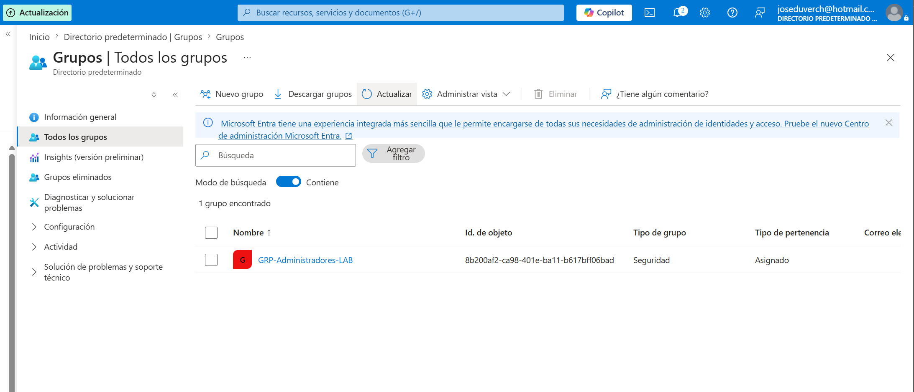


---


## Paso 6 - Agregar miembro


Se agregó el usuario **usuario.lab** al grupo de seguridad.


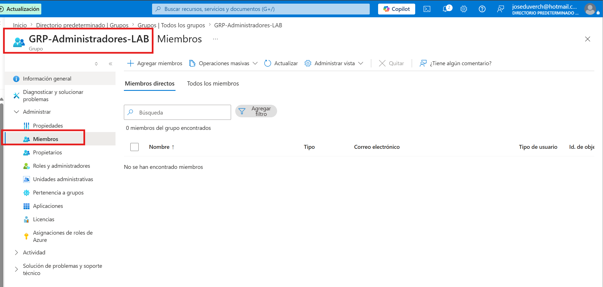


---


## Paso 7 - Usuario agregado


Se verificó que el usuario pertenece correctamente al grupo.


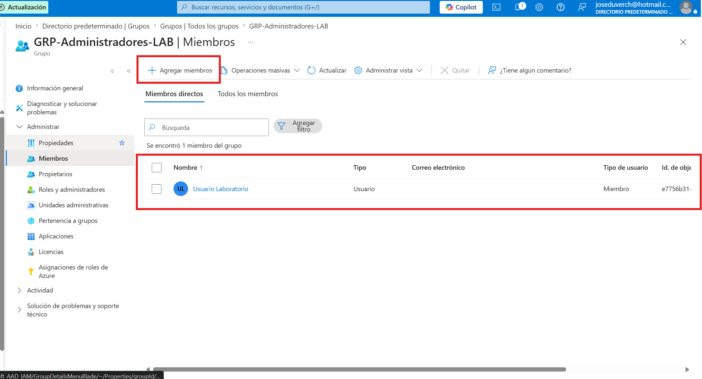


---


## Paso 8 - Restablecimiento de contraseña


Se realizó el restablecimiento de la contraseña del usuario para simular una tarea administrativa.


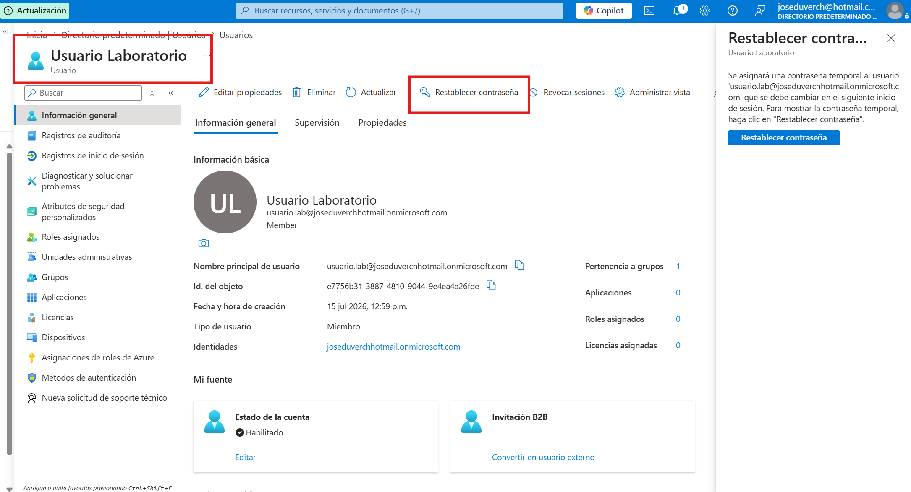


---


## Paso 9 - Contraseña restablecida


Azure generó correctamente una nueva contraseña temporal.


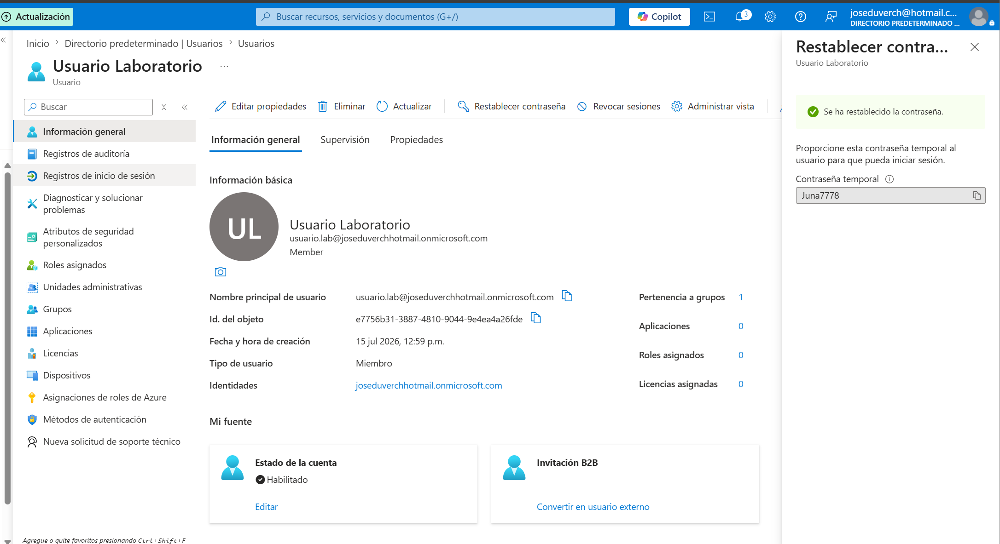


---


## Paso 10 - Deshabilitar cuenta


Se deshabilitó temporalmente el usuario para validar la administración del ciclo de vida de una identidad.


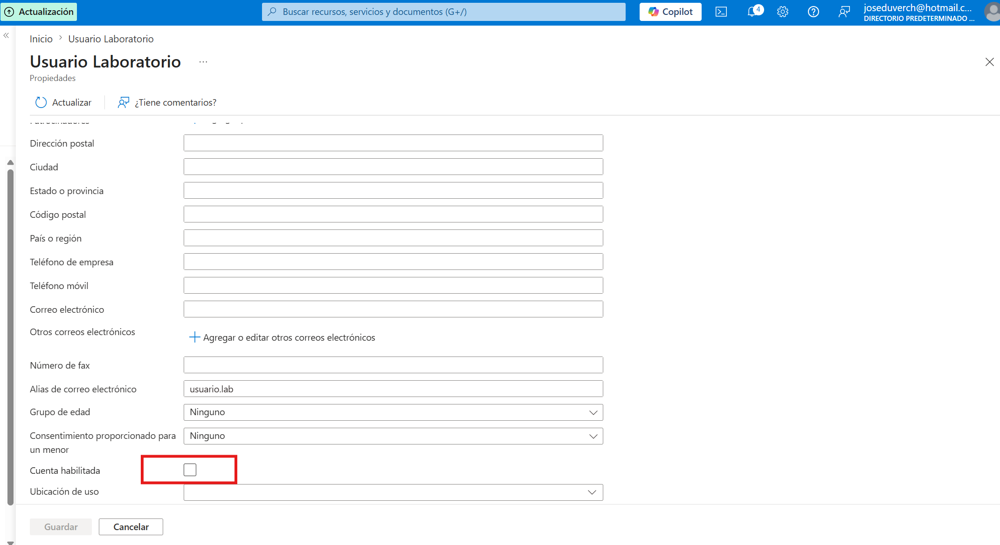


---


## Paso 11 - Habilitar cuenta


Posteriormente se volvió a habilitar el usuario.


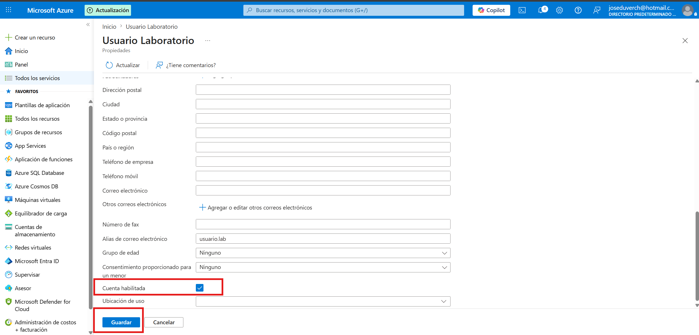


---


## Paso 12 - Rol administrativo


Se seleccionó el rol integrado **Lectores de directorios**.


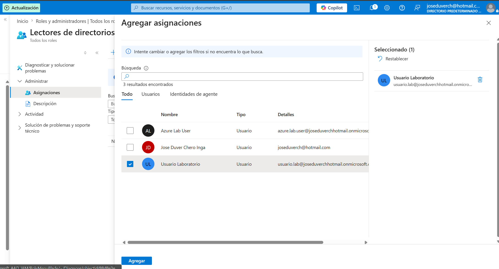


---


## Paso 13 - Asignación del rol


Se asignó correctamente el rol al usuario del laboratorio.


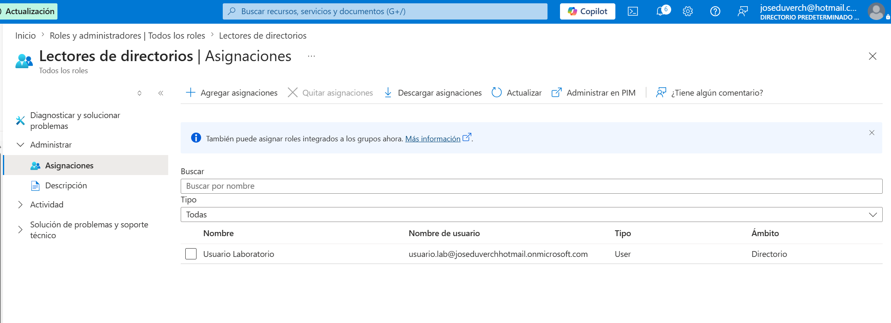


---


## Paso 14 - Validación final


Se verificó:


- Usuario existente.

- Grupo creado.

- Usuario miembro del grupo.

- Cuenta habilitada.

- Rol asignado.


---


# Actividades realizadas


Durante este laboratorio se realizaron las siguientes tareas:


- Creación de usuarios.

- Administración de grupos.

- Administración de membresías.

- Restablecimiento de contraseñas.

- Habilitación y deshabilitación de cuentas.

- Exploración de roles administrativos.

- Asignación de roles en Microsoft Entra ID.


---


# Conocimientos adquiridos


Durante este proyecto se reforzaron los siguientes conceptos:


- Microsoft Entra ID

- Administración de usuarios

- Administración de grupos

- Gestión del ciclo de vida de identidades

- Roles administrativos

- Control de acceso basado en roles (RBAC)

- Seguridad de identidades


---


# Resultado


Se implementó correctamente un entorno básico de administración de identidades utilizando Microsoft Entra ID.


Se crearon usuarios, grupos y asignaciones de roles, además de realizar tareas administrativas habituales como el restablecimiento de contraseñas y la administración del estado de las cuentas, fortaleciendo las habilidades necesarias para la certificación AZ-104 y la administración diaria de entornos Azure.

