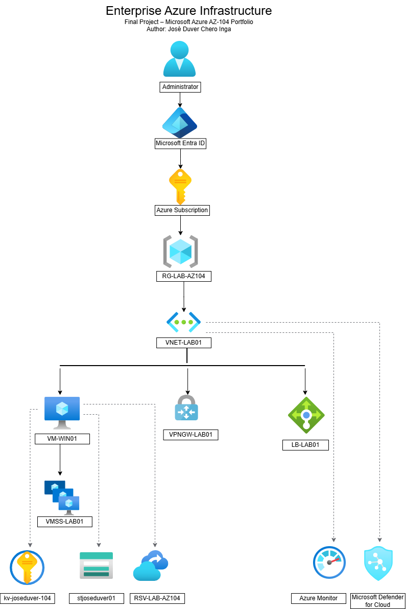

# Arquitectura Empresarial de Azure

## Objetivo

Este proyecto representa una arquitectura empresarial implementada en Microsoft Azure utilizando servicios fundamentales evaluados en la certificación AZ-104: Microsoft Azure Administrator.

La solución integra servicios de identidad, redes, seguridad, monitoreo, recuperación y escalabilidad dentro de una única infraestructura documentada.

---

# Objetivos de la arquitectura

- Centralizar la administración de recursos.

- Implementar una red virtual segura.

- Proteger los secretos mediante Azure Key Vault.

- Implementar monitoreo mediante Azure Monitor.

- Supervisar la postura de seguridad con Microsoft Defender for Cloud.

- Implementar alta disponibilidad mediante Azure Load Balancer.

- Implementar conectividad híbrida mediante Azure VPN Gateway.

- Proteger la información mediante Recovery Services Vault.

- Almacenar información mediante Azure Storage Account.

- Demplegar aplicaciones sobre máquinas virtuales y conjuntos de escalado (VM Scale Sets).

---

# Componentes principales

La arquitectura está compuesta por los siguientes servicios:

- Microsoft Entra ID

- Azure Subscription

- Resource Group

- Virtual Network

- Virtual Machine

- Virtual Machine Scale Set

- Azure Load Balancer

- Azure VPN Gateway

- Azure Key Vault

- Azure Storage Account

- Azure Recovery Services Vault

- Azure Monitor

- Microsoft Defender for Cloud

---

# Diagrama de arquitectura

El siguiente diagrama representa la arquitectura completa implementada.

---

# Flujo general

1. El administrador accede mediante Microsoft Entra ID.

2. Los recursos son administrados desde una suscripción de Azure.

3. Todos los recursos se encuentran organizados dentro de un Resource Group.

4. La infraestructura principal se implementa sobre una Virtual Network.

5. La Virtual Machine representa la carga principal de trabajo.

6. El VM Scale Set permite escalar automáticamente la infraestructura.

7. El Azure Load Balancer distribuye el tráfico hacia los recursos.

8. El VPN Gateway permite la conectividad híbrida.

9. Azure Key Vault almacena secretos y credenciales.

10. Azure Storage Account almacena archivos y datos.

11. Recovery Services Vault protege la información mediante copias de seguridad.

12. Azure Monitor recopila métricas y registros.

13. Microsoft Defender for Cloud supervisa continuamente la seguridad del entorno.

