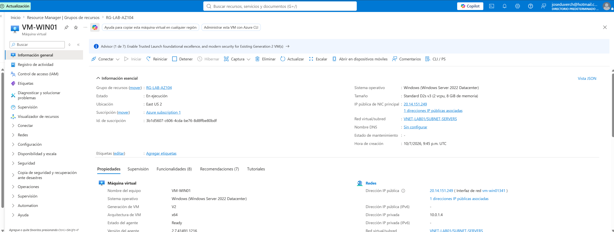
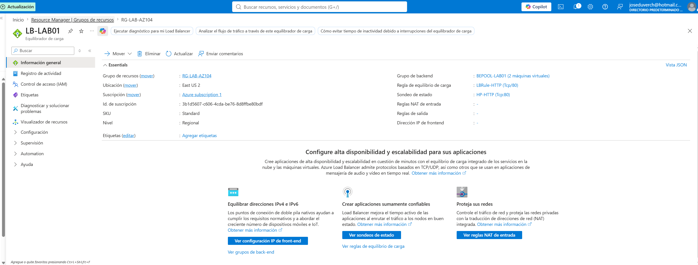
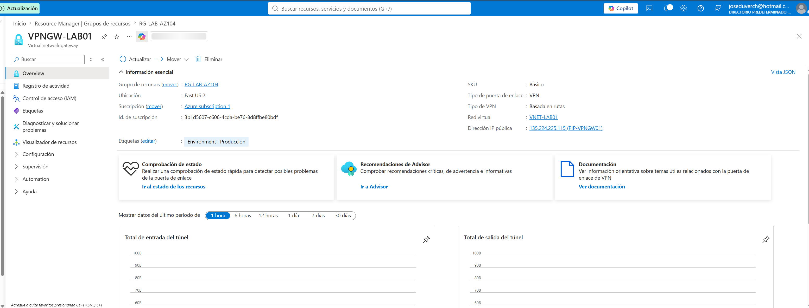
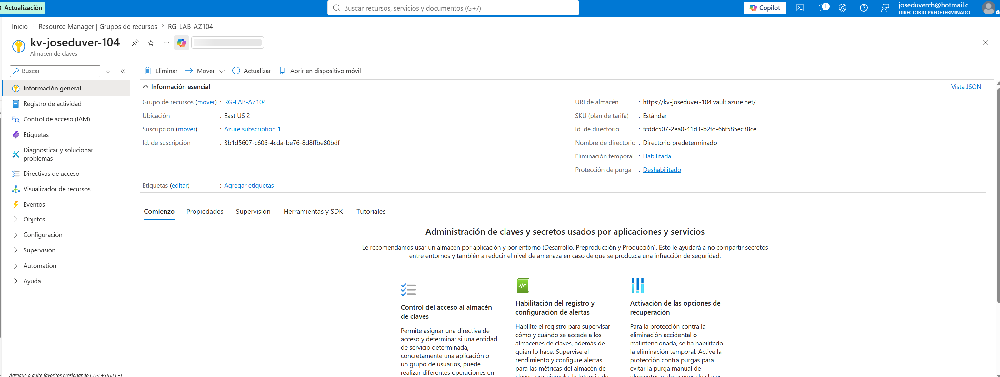
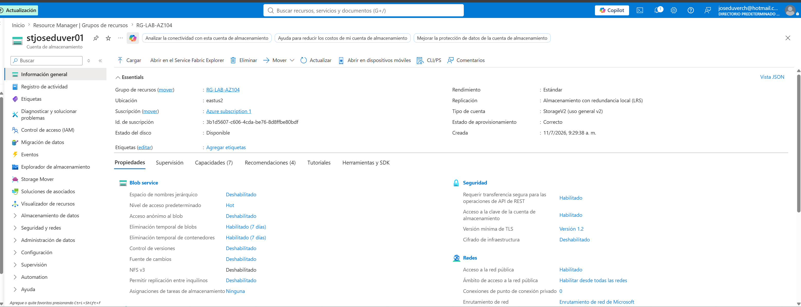
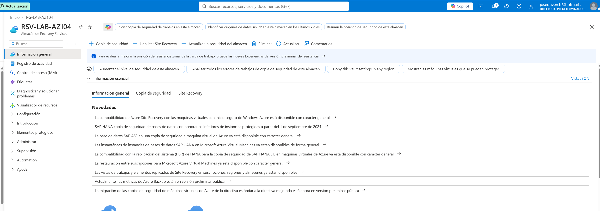
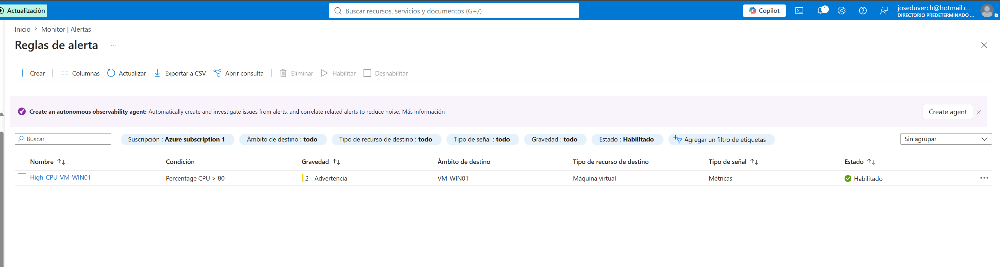
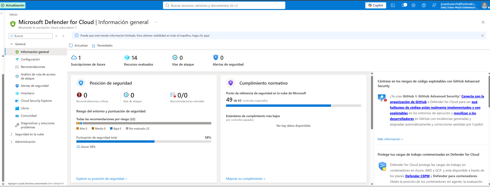

# Validaciones de la Infraestructura

Las siguientes validaciones fueron realizadas para comprobar el correcto funcionamiento de la infraestructura implementada.

---

# Validación 1 - Virtual Machine

## Objetivo

Comprobar que la máquina virtual se encuentra implementada correctamente.

## Resultado

✅ VM-WIN01 creada correctamente.

## Evidencia

---

# Validación 2 - Azure Load Balancer

## Objetivo

Verificar la implementación del balanceador de carga.

## Resultado

✅ Load Balancer configurado correctamente.

## Evidencia

---

# Validación 3 - Azure VPN Gateway

## Objetivo

Verificar la implementación del VPN Gateway.

## Resultado

✅ VPN Gateway implementado correctamente.

## Evidencia

---

# Validación 4 - Azure Key Vault

## Objetivo

Comprobar la creación del almacén de secretos.

## Resultado

✅ Key Vault operativo.

## Evidencia

---

# Validación 5 - Azure Storage

## Objetivo

Comprobar el almacenamiento implementado.

## Resultado

✅ Storage Account creada correctamente.

## Evidencia

---

# Validación 6 - Azure Backup

## Objetivo

Verificar la creación del Recovery Services Vault.

## Resultado

✅ Recovery Services Vault implementado.

## Evidencia

---

# Validación 7 - Azure Monitor

## Objetivo

Verificar la configuración del monitoreo.

## Resultado

✅ Azure Monitor y Alert Rule configurados.

## Evidencia

---

# Validación 8 - Microsoft Defender for Cloud

## Objetivo

Verificar el estado de seguridad de la suscripción.

## Resultado

✅ Defender for Cloud habilitado.

## Evidencia

