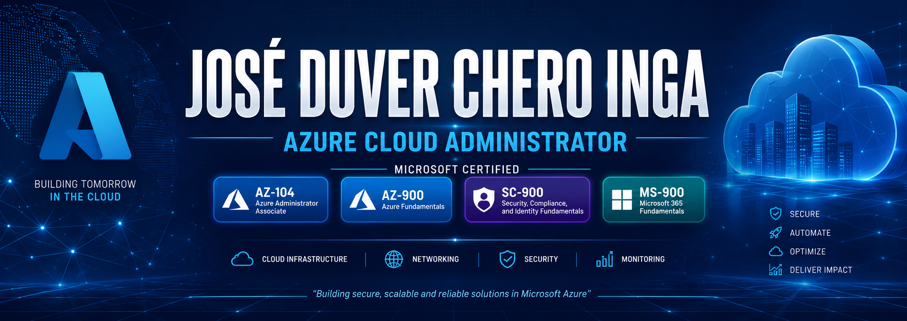

# 👋 Hola, soy José Duver Chero Inga

## Azure Cloud Administrator | Microsoft Certified

Bienvenido a mi portafolio profesional de Microsoft Azure.

Soy un profesional de TI con experiencia en soporte técnico N2 y actualmente estoy orientando mi carrera hacia la administración de infraestructura Cloud sobre Microsoft Azure.

Este repositorio reúne los laboratorios y proyectos que desarrollé para obtener experiencia práctica en administración de infraestructura, redes, seguridad, monitoreo y recuperación ante desastres utilizando Microsoft Azure.

Mi objetivo es incorporarme como **Azure Cloud Administrator**, aportando conocimientos sólidos en administración de plataformas Cloud, buenas prácticas y documentación técnica profesional.

---

# 🎓 Certificaciones Microsoft

| Certificación | Estado |
|--------------|--------|
| Microsoft Certified: Azure Administrator Associate (AZ-104) | ✅ |
| Microsoft Certified: Azure Fundamentals (AZ-900) | ✅ |
| Microsoft Certified: Security, Compliance, and Identity Fundamentals (SC-900) | ✅ |
| Microsoft 365 Certified: Fundamentals (MS-900) | ✅ |

---
# ☁️ Tecnologías

- Microsoft Azure
- Microsoft Entra ID
- Azure Virtual Machines
- Azure Virtual Machine Scale Sets
- Azure Storage Account
- Azure Networking
- Azure Virtual Network
- Azure VPN Gateway
- Azure Load Balancer
- Azure Monitor
- Azure Backup
- Azure Key Vault
- Azure RBAC
- Azure Policy
- Microsoft Defender for Cloud

---
# 💼 Habilidades Técnicas

✔ Administración de Microsoft Azure

✔ Administración de Máquinas Virtuales

✔ Administración de Redes Virtuales

✔ Microsoft Entra ID

✔ Azure Storage

✔ Azure Monitoring

✔ Azure Backup

✔ Azure Security

✔ Azure Networking

✔ Azure Load Balancer

✔ Azure VPN Gateway

✔ Azure Key Vault

✔ Azure RBAC

✔ Azure Policy

✔ Microsoft Defender for Cloud

✔ Documentación Técnica

---

# ⭐ Proyecto Destacado

# Enterprise Azure Infrastructure

Este proyecto representa la implementación de una infraestructura empresarial completa en Microsoft Azure, integrando servicios de identidad, redes, seguridad, monitoreo, almacenamiento y recuperación ante desastres.

Su objetivo es demostrar conocimientos prácticos equivalentes a un entorno corporativo administrado por un Azure Cloud Administrator.

---

## Arquitectura General

---

## Servicios implementados

| Servicio | Implementado |
|----------|--------------|
| Microsoft Entra ID | ✅ |
| Azure Resource Group | ✅ |
| Azure Virtual Network | ✅ |
| Network Security Group | ✅ |
| Azure Virtual Machine | ✅ |
| Azure Virtual Machine Scale Set | ✅ |
| Azure Load Balancer | ✅ |
| Azure VPN Gateway | ✅ |
| Azure Storage Account | ✅ |
| Azure Key Vault | ✅ |
| Azure Backup | ✅ |
| Azure Monitor | ✅ |
| Azure RBAC | ✅ |
| Azure Policy | ✅ |
| Microsoft Defender for Cloud | ✅ |

---

## Escenario empresarial

La infraestructura fue diseñada simulando un entorno empresarial donde múltiples servicios trabajan de forma integrada para proporcionar:

- Administración centralizada.
- Seguridad.
- Alta disponibilidad.
- Monitoreo.
- Protección de datos.
- Escalabilidad.
- Buenas prácticas de infraestructura Cloud.

---

## Tecnologías utilizadas

- Microsoft Azure
- Microsoft Entra ID
- Azure Networking
- Azure Virtual Machines
- Azure Storage
- Azure Monitor
- Azure Backup
- Azure Key Vault
- Azure RBAC
- Azure Policy
- Azure Defender for Cloud
- Azure VPN Gateway
- Azure Load Balancer

---

# 📁 Proyectos del Portafolio

| Proyecto | Estado |
|----------|--------|
| 01 - Resource Group | ✅ |
| 02 - Storage Account | ✅ |
| 03 - Azure RBAC | ✅ |
| 04 - Azure Monitor | ✅ |
| 05 - Managed Disks | ✅ |
| 06 - Azure Backup | ✅ |
| 07 - Networking | ✅ |
| 08 - Load Balancer | ✅ |
| 09 - Virtual Machine Scale Set | ✅ |
| 10 - Virtual Network Peering | ✅ |
| 11 - Network Security Groups | ✅ |
| 12 - Route Tables | ✅ |
| 13 - Azure Key Vault | ✅ |
| 14 - Azure VPN Gateway | ✅ |
| 15 - Microsoft Entra ID | ✅ |
| 16 - Azure Policy | ✅ |
| 17 - Microsoft Defender for Cloud | ✅ |
| 20 - Enterprise Azure Infrastructure | ⭐ Proyecto Integrador |

---

# 🎯 Objetivo Profesional

Mi objetivo es desarrollarme profesionalmente como **Azure Cloud Administrator**, participando en la implementación, administración y optimización de infraestructuras empresariales en Microsoft Azure.

Este portafolio refleja mi proceso de aprendizaje práctico, aplicando escenarios similares a los utilizados en entornos reales de producción y siguiendo las mejores prácticas recomendadas por Microsoft.

---

# 🚀 Próximos Objetivos

- Microsoft Certified: Azure Solutions Architect Expert (AZ-305)
- Azure Landing Zones
- Infrastructure as Code (Bicep / Terraform)
- Azure Automation
- Azure Kubernetes Service (AKS)
- Microsoft Defender XDR
- Azure DevOps

---

# 📫 Contacto

**José Duver Chero Inga**

- 💼 LinkedIn: *(Agregar enlace)*
- 💻 GitHub: https://github.com/joseduverch-gif
- ☁️ Azure Administrator Portfolio

---

⭐ Gracias por visitar mi portafolio.
